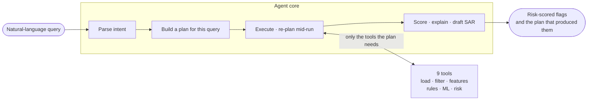

# AI-Powered Suspicious Activity Detection — AML Agent

[](https://github.com/kapilankathirvel/AML_67/actions/workflows/ci.yml)

An agentic system for AML compliance: a natural-language query goes in, the agent parses intent,
**builds a query-specific execution plan** (not a fixed pipeline), calls only the tools that plan needs,
and returns risk-scored, explained, escalation-tagged flags — with the plan itself shown to the user, so
a reviewer can see exactly what the agent decided to do and why.

Built for a 48-hour hackathon, Problem Statement 1 (AI-Powered Suspicious Activity Detection).

---

## Table of contents

1. [Problem statement](#problem-statement)
2. [Domain background](#domain-background)
3. [Solution approach](#solution-approach)
4. [Why this is agentic](#why-this-is-agentic)
5. [Architecture](#architecture)
6. [Repo structure](#repo-structure)
7. [Tech stack](#tech-stack)
8. [Datasets](#datasets)
9. [Setup](#setup)
10. [Usage — example queries](#usage--example-queries)
11. [Results](#results)
12. [Limitations](#limitations)
13. [Team](#team)

---

## Problem statement

Traditional rule-based AML systems generate excessive false positives, overwhelming compliance teams.
Sophisticated laundering techniques — structuring, smurfing, layering — evade naive threshold rules. The
challenge: build an autonomous agent that parses a compliance query, dynamically decides which analysis
tools it needs, detects suspicious patterns (rule-based, ML, or hybrid), scores risk, explains every flag
in plain language, and recommends an escalation action — reducing false positives while staying
explainable enough for a human analyst to trust and act on.

## Domain background

- **The $10,000 threshold.** US banks must file a **Currency Transaction Report (CTR)** for any cash
  transaction ≥ $10,000 (Bank Secrecy Act). **Structuring** (31 U.S.C. § 5324) is the crime of splitting
  transactions to stay under that threshold — independent of whether the underlying funds are illicit.
  This is *why* our structuring rule watches the $9,000–$9,999.99 band specifically, not "large
  transactions" generally.
- **Smurfing** ("fan-out"): distributing funds through many accounts/couriers to obscure the money trail.
- **Layering**: moving funds through a chain of accounts/jurisdictions to sever the audit trail —
  laundering's obfuscation stage.
- **Rapid cash-out**: converting an inbound electronic transfer to physical cash quickly — laundering's
  integration stage.
- **FATF 40 Recommendations** (1, 3, 10) require enhanced due diligence on exactly these patterns.
- **SARs** (Suspicious Activity Reports, FinCEN Form 111) are filed regardless of amount when laundering
  is suspected — our agent drafts one automatically for every `HIGH`-risk flag. The CTR above is Form 112;
  Form 114 is the unrelated FBAR.

Full regulatory citations, per-rule thresholds, and business justification: **[AML_LOGIC.md](docs/AML_LOGIC.md)**.

## Solution approach

**Hybrid detection = rule-based (explainable, precise) + ML anomaly detection (recall, catches novel
patterns) + a fused risk score.**

- **Rules R1–R7** (structuring, smurfing, layering, rapid cash-out, velocity spike, dormant
  reactivation, and receiver-side structuring)
  — each with a documented regulatory rationale and threshold, emitting rule-specific evidence.
- **ML**: IsolationForest + LocalOutlierFactor over per-customer AML features (rolling sums,
  threshold-proximity ratio, self-deviation z-scores, velocity, pass-through ratios, ...).
- **Fusion** (`docs/CONTRACTS.md` Contract 5): `risk_score = 100 × (0.6 × rule_weight + 0.4 × ml_percentile)`,
  banded into `HIGH → report` / `MEDIUM → review` / `LOW → monitor` / `NONE → no_action`.
- **Explanation**: a deterministic template built from each rule's actual evidence (always accurate,
  always available, LLM-optional). An LLM polish pass rewrites `HIGH`-risk explanations into an
  analyst-facing paragraph — capped to `HIGH` only, both to protect a free-tier rate limit and because
  those are the flags that matter most (they're the ones getting a SAR draft).

## Why this is agentic

The system is graded on **not** being a fixed pipeline. The planner (`backend/agent/planner.py`) builds a
genuinely different tool sequence per query intent — verified by an automated test
(`tests/test_planner.py`, `tests/test_integration.py`) that asserts the plans for these three queries
*differ*:

| Query | Tools invoked | Tools explicitly skipped (and why) |
|---|---|---|
| *"Is customer 4521 suspicious?"* | `load_data → filter_data → entity_lookup → feature_engineer → rule_detect → ml_detect → risk_classify` | `eda_profile` (not exploring) |
| *"Show transaction distribution by country"* | `load_data → filter_data → eda_profile` | `feature_engineer`, `rule_detect`, `ml_detect`, `risk_classify` (no detection requested) |
| *"Which customers made 10+ transactions under $10,000?"* | `load_data → filter_data → aggregate_query` | `feature_engineer`, `ml_detect`, `eda_profile` (a deterministic count answers this exactly) |
| *"Analyse this dataset for suspicious activity"* | `load_data → eda_profile → feature_engineer → rule_detect → ml_detect → risk_classify` | — (full sweep) |

> `ml_detect` used to be skipped for the single-entity query too, on the reasoning that one customer is
> too small a sample to rank. That reasoning didn't match the plan it was in: `feature_engineer` there
> runs across the *whole* population, so `ml_detect` receives all 270 customers. Skipping it zeroed the
> ML half of the risk formula, and C-STR02 came back **51.00 MEDIUM** when asked about directly versus
> **89.84 HIGH** in a full sweep. The sample-size guard belongs on data size, not intent name — and it
> already exists twice at runtime (see the re-planning rules below).

The executor also **re-plans mid-run**, not just at planning time:
- `rule_detect` returns 0 hits → appends `ml_detect` to widen the net
- filtered subset < 50 rows → drops a queued `ml_detect` (insufficient sample)
- `filter_data` returns 0 rows → stops early with an explanatory summary, not an empty crash

Every decision — what ran, what was skipped, what got added mid-run, and why — is logged to
`plan.decisions[]` / `plan.tools_considered_but_skipped[]` and shown directly in the UI's execution-plan
trace panel. That panel, not the ML, is the thing this project is actually graded on.

### Two planners: an LLM one, with a deterministic floor

The table above is the **deterministic** planner: one branch per intent, and the tool sequence within a
branch is fixed. It is a routing table, and calling it "agentic" on its own would be overselling it.

Setting `AML_LLM_PLANNER=1` enables a second planner (`backend/agent/llm_planner.py`) in which the model
genuinely chooses the tools. It is shown the real tool catalog — built by `backend/agent/tool_schema.py`
from each tool's own `@tool(description=..., params=...)` declaration, so it can never drift from what the
tools actually accept — and returns a proposed sequence. That proposal is not trusted:
`backend/agent/plan_validator.py` checks it against twelve rules before anything executes.

| Check | Rejects |
|---|---|
| Registry | a tool name that doesn't exist |
| Ordering | `rule_detect`/`ml_detect` without `feature_engineer` first; `risk_classify` with nothing to fuse; `filter_data` before `load_data` |
| Structure | `load_data` not first, duplicated tools, more than 12 steps, a step with no stated reason |
| Params | a parameter name the tool doesn't declare |
| Context | `entity_lookup` when the query names no entity |

The ordering rules mirror real preconditions in the tool bodies (`rules.py` reads
`ctx.artifacts["features"]`, `risk.py` reads `rule_hits`/`ml_scores`), so a plan that passes cannot fail on
a missing artifact. **On any rejection — or if the LLM is unavailable, or returns unparseable JSON — the
deterministic plan runs instead.** That is what makes this safe to turn on: the routing table above is the
guaranteed floor of the system's behaviour, never the ceiling.

The whole exchange is written to the same `plan.decisions[]` the UI already renders:

```
planner: source=llm
planner: proposed = load_data -> filter_data -> feature_engineer -> rule_detect -> risk_classify
planner: validated OK against 9 registered tools
planner: injected filter_data params from the parsed query: amount_min
planner: executed = load_data -> filter_data -> feature_engineer -> rule_detect -> risk_classify
```

and when a proposal is refused:

```
planner: source=deterministic (LLM plan rejected)
planner: proposed = load_data -> rule_detect -> feature_engineer
planner: rejected — rule_detect requires feature_engineer before it
planner: fell back to the deterministic plan for intent 'pattern_search'
planner: executed = load_data -> filter_data -> feature_engineer -> rule_detect -> ml_detect -> risk_classify
```

The `executed` line is appended *after* the run, so it captures the executor's own mid-run re-planning —
in that second example the deterministic plan included `ml_detect`, which the proposal had omitted. A
compliance reviewer can therefore see what the model wanted, whether it was allowed, why not if it wasn't,
and what actually ran. "The model chose it" becomes checkable rather than asserted.

**The flag defaults to off.** There is no `tests/conftest.py` in this repo — each test file stubs the LLM
per-module — so a default of on would let the test suite and the evaluation harness issue real API calls.
Off by default also means every published metric is produced by the deterministic path:
`evaluation/run_evaluation.py` pins the flag explicitly, and the results are byte-identical with the LLM
planner present or absent.

#### Measured: how often does a real model produce a usable plan?

Regenerate with `python -m evaluation.measure_planner --provider groq`. 15 queries spanning all 7
intents; intents are constructed deterministically so this measures the planner, not the intent parser.

| Model | Usable plans |
|---|---|
| Local `qwen2.5:3b-instruct` | 27% (4/15) |
| Hosted (Groq) | **93% (14/15)** |

**That gap is the answer to "is the design sound, or is the model just small?"** — it was the model. The
same validator, the same prompt, the same 15 queries: a hosted model produces a usable plan almost every
time. **11 of the 14 accepted plans differ from what the deterministic planner would have emitted**, so it
is genuinely planning rather than reproducing the routing table.

The single hosted failure is instructive rather than alarming: it put `date_from`/`date_to` on
`load_data` instead of `filter_data` — a plausible mistake that V10 caught before anything ran.

The 3B result is kept because it is the more interesting engineering story. Getting from 20% to 27% on it
is what produced V12, V13 and the `load_data` repair — every one of those rules was written because a
weak model found a hole a strong one never exercises. **A weak model is a better validator test than a
strong one.**

| Stage | Accepted by validator | Plans that can actually answer |
|---|---|---|
| Validator as first written | 20% | 7% |
| + `pattern_types` alias, + constraints moved into the schema hint | **60%** | 7% |
| + V12 (answerability) | 13% | 13% |
| + `load_data` auto-repair | **27%** | **27%** |

Two things this exposed that the design did not anticipate, both worth more than the final number:

**A rising acceptance rate was hiding a falling one.** At 60% accepted, only 1 plan in 15 was useful. The
model had learned that *shorter plans pass* — a truncated plan satisfies every ordering rule vacuously, so
`"who are my riskiest customers?"` came back as `load_data → filter_data → feature_engineer`: legal,
computes features, detects nothing, returns zero flags. V12 requires each intent's terminal tool
(`risk_classify`, `eda_profile` or `aggregate_query`) to be present, which dropped acceptance to 13% and
made the two numbers identical. Lower and honest beats higher and wrong.

**Over half the rejections were ceremony, not bad planning.** The single biggest failure was omitting
`load_data` — 8 of 13 rejections. But `load_data` is not a planning decision: all eight deterministic
branches begin with it and no query exists where skipping it is right, so requiring the model to emit it
tested nothing and cost half the acceptance rate. It is now repaired and logged rather than rejected. The
line held elsewhere: nothing that involves a real choice — which detectors run, which patterns to test —
is ever repaired, or "the LLM chose this plan" would stop being true.

What remains is model capacity, not prompt wording. The prompt names the required tool for that specific
query, and a 3B model still returned a one-step plan for *"what does this dataset look like?"*.

**The failures are systematic, not noisy** — which matters more than the percentage. Repeating all 15
queries three times, clearing the LLM response cache between repeats so nothing replays:

```
per-run useful counts : [4, 4, 4] of 15      stdev 0.0 points
always accepted : 4      always rejected : 11      unstable : 0
rejection reasons across 45 proposals: 27 answerability, 6 dependency ordering, 0 other
```

The model succeeds on exactly the same four queries every time and fails the same eleven. It never once
produces a working plan for `eda`, `threshold_query`, `entity_investigation` or `explain_flag`. That is a
reproducible capability boundary rather than sampling variance — worth stating, because a single 15-query
run has **6.7 points of granularity per query**, and an earlier run of 33% turned out to be one query of
between-process drift rather than an improvement.

Two limits on that number, both worth knowing before quoting it:

- **V13 never fired in the harness.** Across all 45 proposals the model emitted no invalid pattern value.
  The rule is verified by replaying the proposal captured from a live run, not by the harness.
- **The harness cannot reproduce the bug V13 exists for.** It constructs `QueryIntent` objects directly to
  isolate the planner from parser variance. The live API path runs `parse_intent` first, producing
  different intent state, a different prompt, and proposals the harness never generates — including the
  `pattern_types: ["risk"]` that motivated V13. Measuring the planner in isolation and measuring it in
  situ are different measurements, and only the first one is automated here.

**The part that did hold: across ~75 real proposals, zero bad plans reached the executor.** Every
truncated, dependency-violating and malformed proposal was caught. Proposal quality is bounded by the
model; the safety property is not.

### Mid-run re-planning: the observe → decide → act loop

Everything above happens *before* any data is loaded. `AML_LLM_REPLANNER=1` closes that gap: after each
step the model is shown a digest of what actually happened — row counts, how many rule hits and across
which rules, ML percentile spread, risk rows by band — and may revise **the steps that have not run yet**.

`ctx.artifacts` has carried those observations since the project began; until `backend/agent/replanner.py`
existed, nothing read them into a prompt. That was the concrete sense in which this was a planner rather
than an agent.

Three properties make it safe to turn on:

- **It cannot rewrite history.** The revision is validated as `executed_prefix + proposed_suffix` through
  the *same* `validate_proposal`, so V3 (no duplicates) stops a re-run of `load_data`, V12 still requires
  the terminal tool, and V14 still forbids the capabilities a plan may not reach. One rule set, no second
  implementation to drift.
- **The three hardcoded runtime rules stay underneath it**, exactly as `build_plan` sits under
  `plan_query`. Model declines or proposes something illegal → behaviour is what it was before.
- **It is capped at 2 routine interventions per request**, plus 1 reserved for failures, and defaults off.

**It observes failures, not just successes.** The first version ran only after a step that succeeded —
the executor's three error paths each `continue`d straight past it — which left it blind in the one
situation it exists for. A failed `rule_detect` is the clearest case: `risk_classify` is still queued
with nothing to classify, and the hardcoded "0 rule hits → append `ml_detect`" rule cannot help because
it lives on the success path. Falling back to `ml_detect` is legal, useful, and reachable only by the
loop. The failure allowance is separate for a measured reason: on a five-step plan the routine budget is
spent by step two, so a failure at step four found nothing left and the loop stayed blind in practice
even after it could see.

**Measured, and the result is a negative one worth reporting.** Five queries through the full pipeline
with a hosted model, loop on versus off: it produced decisions on 5/5 queries and **declined to revise on
every single one**. The outcome differed on 0/5.

That is the correct behaviour rather than a failure. The same model plans well enough up front (93%) that
by the time it sees the observation there is nothing to fix — a re-planner earns its keep when the initial
plan is wrong or the data surprises it, and neither happened here. It would be easy to manufacture a
scenario where it fires; the honest report is that on realistic queries with a good planner, it correctly
does nothing.

One caveat on the latency figure: the comparison ran loop-off first, which warmed
`backend/llm/client.py`'s prompt cache, so the loop-on pass got its *planning* calls for free. The
measured `+0.2s` therefore understates the true cost — budget roughly one extra round trip per
intervention.

Full intent → tool mapping table: **[docs/CONTRACTS.md](docs/CONTRACTS.md) Contract 4**.

## Architecture



**One pass through the whole system, layer by layer — what each part does, why it was built that way,
what was measured, and what is honestly wrong with it: [PROJECT_GUIDE.md](docs/PROJECT_GUIDE.md).**
The best starting point if you are reading this repo for the first time.

**Full technical documentation — architecture, analysis algorithms, and UI design in one place:
[DOCUMENTATION.md](docs/DOCUMENTATION.md).**

What changed between the hackathon submission and this repository, and why:
**[AFTER_THE_DEADLINE.md](docs/AFTER_THE_DEADLINE.md)**.

Component detail, the full Pydantic contract, and sequence diagrams: **[ARCHITECTURE.md](docs/ARCHITECTURE.md)**.
The frozen interface both halves of this project are built against: **[docs/CONTRACTS.md](docs/CONTRACTS.md)**.
The two-person parallel build plan (for context on how this repo came together):
**[WORKPLAN.md](docs/WORKPLAN.md)**.

## Repo structure

```
soc/
├── backend/
│   ├── main.py                 # FastAPI app — POST /query, GET /health
│   ├── config.py                # env-driven settings (AML_USE_MOCKS, AML_DATASET_PATH, ...)
│   ├── schemas.py                # FROZEN — Pydantic contract (QueryIntent, ExecutionPlan, AgentResponse, ...)
│   ├── agent/
│   │   ├── intent_parser.py     # NL query → QueryIntent (LLM primary, regex fallback)
│   │   ├── planner.py           # QueryIntent → ExecutionPlan (query-specific tool sequence)
│   │   ├── executor.py          # runs the plan, threads ToolContext, conditional re-planning
│   │   ├── narrator.py          # explanation + escalation text per flag
│   │   └── registry.py          # auto-discovers @tool-decorated functions
│   ├── llm/
│   │   └── client.py             # provider-agnostic adapter (Gemini/OpenAI/Groq/Ollama) + regex fallback
│   └── tools/
│       ├── base.py               # FROZEN — ToolContext, ToolResult, @tool decorator
│       ├── data_loader.py        # Kaggle/synthetic CSV → canonical schema
│       ├── filters.py, aggregate.py, entity.py, eda.py
│       ├── features.py           # per-customer AML feature engineering
│       ├── rules.py              # R1–R7 rule-based detectors
│       ├── ml_detect.py           # IsolationForest + LocalOutlierFactor
│       └── risk.py                # rule + ML score fusion → HIGH/MEDIUM/LOW/NONE
├── frontend/
│   ├── app.py                    # Streamlit entry point
│   └── components/
│       ├── plan_trace.py         # execution-plan trace panel
│       ├── flag_cards.py         # flagged-entity cards + SAR draft
│       ├── charts.py              # Plotly visualisations
│       └── theme.py               # shared styling
├── data/
│   ├── sample/aml_sample.csv     # committed synthetic demo dataset (labelled ground truth)
│   ├── generate_synthetic.py     # synthetic dataset generator (fixed seed)
│   ├── build_ibm_cache.py        # optional: real IBM Kaggle dataset → canonical schema
│   └── adapters/                  # per-source schema adapters
├── tests/                          # pytest — planner, executor, rules, ML, no-label-leakage, API, ...
├── docs/                            # all project documentation
│   ├── CONTRACTS.md               # FROZEN — the interface Track A and Track B build against
│   ├── DOCUMENTATION.md            # full technical documentation (architecture + algorithms + UI)
│   ├── ARCHITECTURE.md             # agent design detail and component sequences
│   ├── AML_LOGIC.md                # rule definitions, thresholds, regulatory justification
│   ├── DATA_CARD.md                # dataset sources, schema, preprocessing decisions
│   ├── WORKPLAN.md                 # the two-person parallel build plan
│   └── TRACK_A_*.md, ANTI_HALLUCINATION_*.md, OLLAMA_SETUP_MAC.md
├── run_demo.py                     # starts backend + frontend, opens the browser
├── requirements.txt / requirements-data.txt
└── README.md, CLAUDE.md            # the only markdown kept at repo root
```

## Tech stack

| Layer | Choice |
|---|---|
| Backend | FastAPI + uvicorn, Pydantic v2 |
| Agent core | Python — intent parser, planner, executor, narrator (no agent framework; the plan/execute/re-plan loop is hand-rolled and fully inspectable) |
| LLM | Gemini, OpenAI, Groq, or **Ollama (local, no key/quota)** — one adapter, always with a regex fallback |
| Data / detection | pandas, numpy, scikit-learn (IsolationForest, LOF), networkx (layering chains) |
| Frontend | Streamlit + Plotly |
| Tests | pytest — 190+ tests |

## Datasets

| Dataset | Role | Source | License / citation |
|---|---|---|---|
| **IBM Transactions for AML** (HI-Small) | Primary real-world base | [Kaggle: ealtman2019/ibm-transactions-for-anti-money-laundering-aml](https://www.kaggle.com/datasets/ealtman2019/ibm-transactions-for-anti-money-laundering-aml) | Altman, Baeck, Gerlach — "Realistic Synthetic Financial Transactions for Anti-Money Laundering Models," NeurIPS 2023 Datasets and Benchmarks |
| **Synthetic overlay** (`data/sample/aml_sample.csv`) | Original committed demo dataset — guarantees structuring/smurfing/layering/rapid-cashout patterns are present and labelled, no Kaggle download required to run the demo | `data/generate_synthetic.py`, fixed seed (42) | Ours — full schema, field definitions, and generation logic documented in [DATA_CARD.md](docs/DATA_CARD.md) |
| **Alt-schema synthetic dataset** (`data/sample/aml_sample_alt.csv`, 1,710 transactions / 294 customers) | **Default dataset the live agent actually queries** (`load_data`'s `source` parameter defaults to `"synthetic_alt"` — see `backend/tools/data_loader.py`). Same laundering typologies as the original synthetic set, but generated with a deliberately different raw schema (renamed headers, coded enums, `ACC-`-prefixed account IDs, no `is_cross_border` column) to prove the canonical-schema adapter (`docs/CONTRACTS.md` Contract 0) generalises to a raw format it wasn't hand-fit to, rather than being hardcoded to one CSV's column names | `data/generate_synthetic_alt.py`, fixed seed | Ours |

All three are adapted into one canonical schema (`docs/CONTRACTS.md` Contract 0) before any detection code
touches them — the datasets are fully swappable via `load_data(source=...)` (`'ibm'`, `'ibm_stratified'`,
`'synthetic'`, or `'synthetic_alt'`). Full field-by-field preprocessing decisions, raw dataset statistics,
and every assumption made by each synthetic generator: **[DATA_CARD.md](docs/DATA_CARD.md)**.

## Setup

```bash
git clone <this repo>
cd soc

python -m venv .venv
.venv/Scripts/activate          # Windows
# source .venv/bin/activate     # macOS/Linux

pip install -r requirements.txt

cp .env.example .env            # optional — see below

python run_demo.py              # starts backend (FastAPI) + frontend (Streamlit), opens the browser
```

The committed sample dataset (`data/sample/aml_sample.csv`) means the demo runs **with no Kaggle download
and no LLM API key** — `AML_USE_MOCKS=0` (the default in `.env.example`) points at the real detection
pipeline over that sample data; without an LLM key, intent parsing and explanations use the
always-available regex/template fallback, not a degraded mode.

**To use a real LLM** (optional, improves messy/informal query phrasing and polishes HIGH-risk
explanations): set `LLM_PROVIDER` and the matching key in `.env` (`gemini`, `openai`, or `groq`). Free-tier
rate limits are respected by design — LLM calls happen at most once per query for intent parsing (and are
response-cached, so re-running the same query during a demo costs nothing further), and explanation
polishing is capped to `HIGH`-risk flags only (a `full_analysis` query can produce dozens of flags;
polishing all of them would exhaust a free-tier quota on a single request for no benefit, since the
template text is already accurate).

**To use a local LLM instead (no key, no quota at all)**: set `LLM_PROVIDER=ollama` after installing
[Ollama](https://ollama.com/download) and pulling a model (`ollama pull qwen2.5:7b-instruct`). See
[OLLAMA_SETUP_MAC.md](docs/OLLAMA_SETUP_MAC.md) for Mac-specific setup; the same `LLM_PROVIDER=ollama` works
identically on Windows/Linux once Ollama is installed there.

**To download the real IBM Kaggle dataset instead of the synthetic one**, `kaggle`/`kagglehub` credentials
are required — see [DATA_CARD.md](docs/DATA_CARD.md) §1.1.

**Manual start** (equivalent to `run_demo.py`, useful for separate terminals / debugging):
```bash
uvicorn backend.main:app --port 8000       # terminal 1
streamlit run frontend/app.py               # terminal 2 (reads AML_API_URL, defaults to localhost:8000)
```

**Demo with the LLM planner (Windows):**

```powershell
.\scripts\run_demo.ps1 check        # is Ollama up, is the model pulled?
.\scripts\run_demo.ps1 backend      # terminal 1 — planner ON
.\scripts\run_demo.ps1 frontend     # terminal 2
```

The script exists because two settings fail *quietly* when set by hand, and a run that has gone wrong looks
identical to one that worked:

- `AML_LLM_PLANNER` defaults to `0`, so the plan trace shows none of the `planner:` audit lines the demo is
  meant to show. (It defaults off deliberately — see the note above about `conftest.py`.)
- `OLLAMA_MODEL` defaults to a 7B that may not be pulled. A model that isn't on disk makes every LLM call
  return `None`, and the fallbacks are good enough that the system just runs deterministically without
  complaint.

`run_demo.ps1 backend` refuses to start rather than launch into that second state, and `check` tells you
the exact `ollama pull` command if the model is missing. Add `-Deterministic` to run the intent→tool table
instead, which is useful for demonstrating both modes side by side. It sets environment variables for its
own process only — nothing on disk is modified, and env vars take precedence over `.env`.

**Run the test suite:**
```bash
pytest tests/ -v
```

### Deploying it

The app is normally **two processes** — Streamlit talking HTTP to FastAPI — which is right for a bank
and impossible on a free single-process host. [`frontend/api_client.py`](frontend/api_client.py) removes
that assumption without changing the architecture:

| `AML_API_URL` | Transport | Processes |
|---|---|---|
| set | HTTP to that API, exactly as before | 2 |
| unset / blank | the backend is imported and called directly | 1 |

The in-process path calls `backend.main`'s own endpoint functions rather than re-running
`intent_parser → planner → executor` itself. **There is one implementation of what a query does**, so a
deployed demo and a local two-process run cannot drift apart. It is not a fallback for an API that is
down: if `AML_API_URL` is set and unreachable, the UI drops to FIXTURE mode as it always has, because
hiding an outage behind a working-looking demo is worse than showing the banner.

**To deploy on Streamlit Community Cloud:** point it at `frontend/app.py`, set Python to 3.11, and
paste [`.streamlit/secrets.toml.example`](.streamlit/secrets.toml.example) into the Secrets box.
Full step-by-step instructions, including verification and troubleshooting, are in
**[docs/DEPLOYMENT.md](docs/DEPLOYMENT.md)**.

`requirements-deploy.txt` is the trimmed dependency list, for the case where the root
`requirements.txt` is too heavy to build. It is not needed by default — the four packages it drops
(`jupyter`, `kaggle`, `kagglehub`, `pytest`) slow the build but are never imported, so they cost
build time rather than runtime memory.

Three things that file gets right and are easy to get wrong:

- **`AML_DATA_SOURCE = "synthetic"`.** The application default is `synthetic_alt`, a *different
  population* (1,710 txns / 294 customers against 2,002 / 270, no overlapping IDs). A demo left on the
  default answers questions about one dataset while this README reports another.
- **`AML_LLM_PLANNER` and `AML_LLM_REPLANNER` off.** The regex parser covers all seven intents and the
  deterministic planner is the floor, so every button works with no key — and a free-tier quota behind
  a public URL would let the first visitor to exhaust it degrade the demo for everyone after. Every
  published metric comes from the deterministic path anyway.
- **`AML_API_URL` blank**, which is what selects single-process mode.

**Measured cost.** Peak resident memory through a full session is **254 MB** — 77 MB for pandas, 152 MB
after scikit-learn, 213 MB with the dataset loaded, 252 MB after a `full_analysis` — and it *levels
off*: a third query used exactly what the second did, so nothing leaks. Against Community Cloud's ~1 GB
that is comfortable, and an earlier version of this section calling memory "the real risk" was caution
without evidence. What actually breaks the deploy is the Python version — the pinned `pandas` and
`pillow` publish no wheels for 3.13+, so anything newer compiles from source and fails.

Speed is the honest cost, not memory. The first **Full analysis** click takes **~60s** because it runs
the whole detection stack; the threshold query returns in ~4s, precisely because the agent plans
differently for it. Cold starts add ~30s. If a host ever does run out of room, Hugging Face Spaces
gives 16 GB and Docker, and can run both processes as originally designed.

**Continuous integration** ([`.github/workflows/ci.yml`](.github/workflows/ci.yml)) is split by
measurement, not intuition. The full suite is **398 tests in ~18–23 minutes**, and almost all of that sits
in six files that drive the real feature pipeline — `feature_engineer` over 2,002 transactions costs
~27s, and several test classes pay it per test. So:

- **On push and PR:** everything else — **290 tests in ~3½ minutes** (2m15s on a runner). Expressed as an *ignore* list, so
  a new test file joins the fast job automatically; a file silently skipped by CI is invisible, whereas
  one that makes the fast job slow is obvious the first time somebody waits for it.
- **Nightly:** the full suite, plus `python -m scripts.check_baselines`, which regenerates
  `run_evaluation`, `ablation` and `evasion` and diffs them against the JSON committed under
  `evaluation/results/`. That is the check for a detection change that passes every test and still
  leaves this README describing a system that no longer exists.

Runners have no `.env`, so CI runs on `backend/config.py`'s defaults: mocks on, both LLM paths off, no
keys. That was verified to give byte-identical results to a local run with `.env` present — the
per-module LLM stubbing in each test file is what makes the suite insensitive to it.

## Usage — example queries

Type a query, or click one of the UI's example buttons. Each of these exercises a different point in the
intent → plan mapping table above:

| Query | Intent | What you'll see |
|---|---|---|
| `Analyse this dataset for suspicious activity` | `full_analysis` | Full EDA + rule + ML sweep; dozens of flags across risk bands |
| `Find structuring patterns in the last 30 days` | `pattern_search` | Only structuring-scoped features/rules run; date filter applied (anchored to the dataset's own date range, not wall-clock "today") |
| `Which customers made 10+ transactions under $10,000?` | `threshold_query` | Direct aggregation, **no ML step at all** — visibly absent from the plan trace |
| `Is customer 4521 suspicious?` | `entity_investigation` | Single-entity scoring; a bare number is resolved against the real dataset's customer IDs (which aren't purely numeric — see [Limitations](#limitations)) |
| `Top 5 highest-risk customers` | `ranking` | Full sweep, truncated to the top 5 by risk score |
| `Show transaction distribution by country` | `eda` | Profiling only — no detection tools run |
| `Why was customer C-STR02 flagged?` | `explain_flag` | Scores just that one entity and returns its explanation directly |

Every response includes: the detected intent + extracted filters/entities, the full execution plan (steps
taken, steps skipped and why, any mid-run re-planning), the flagged entities with risk score/level/escalation/
explanation, and (for `HIGH` risk) a SAR draft.

## Results

Rule thresholds and their regulatory justification are documented per-rule in
[AML_LOGIC.md](docs/AML_LOGIC.md) — e.g. R1 (structuring) requires **3 transactions in a 7-day window** in the
$9,000–$9,999.99 band, which is what separates it from a naive "flag any transaction over $9,000" rule
(the latter would flag every legitimate large transaction; ours requires a *pattern*, corroborated further
by the ML anomaly score before reaching `HIGH`/SAR territory — see Contract 5's fusion formula).

### Quantitative validation

Computed against the original synthetic dataset's ground truth (`data/sample/aml_sample.csv`'s
`label_is_laundering` field — 202 of 2,002 transactions, injected by the generator across the
structuring/smurfing/rapid-cashout/layering cohorts; see [DATA_CARD.md](docs/DATA_CARD.md)). Not validated
against the raw IBM Kaggle dataset — that requires a Kaggle download not run in this environment; the
synthetic set is the labelled ground truth actually available here.

Every number below is **generated, not hand-written** — regenerate with:

```bash
python -m evaluation.run_evaluation
```

> **Note:** `load_data` defaults to the alt-schema synthetic dataset (`source="synthetic_alt"`, see
> [Datasets](#datasets)) for live queries. The evaluation pins `source="synthetic"` explicitly, because
> the labelled ground truth lives in `aml_sample.csv`; scoring flags from one dataset against labels from
> the other silently compares two different customer populations, and the harness now fails loudly rather
> than reporting it.

**Methodology**: our system flags *customers*, not individual transactions, so transaction labels must be
lifted to customer level. There are two defensible ways to do that, and they answer different questions,
so both are reported:

- **Sender-side** — positive if the customer *sent* at least one labelled transaction (51 of 270). This
  matches what most rules look at.
- **Broader** — positive if they sent *or received* one (114 of 270). The extra 63 are receive-only
  participants, e.g. the destination accounts in a structuring scheme.
- **Repeat-receiver** — positive if they sent one, *or received at least two* (84 of 270). The middle
  ground, and arguably the most honest target — see [why it exists](#why-a-third-definition) below.

The naive baseline ([AML_LOGIC.md](docs/AML_LOGIC.md) §6: "flag any transaction with `amount > $9,000`") is
translated the same way, to a fair customer-level comparison.

**Sender-side ground truth**

| | Flagged | Precision | Recall | False-positive rate |
|---|---|---|---|---|
| **Naive baseline** (any txn > $9,000) | 259 / 270 | 0.197 | 1.000 | 0.950 |
| **Our system — any flag** (LOW/MEDIUM/HIGH) | 41 / 270 | 0.561 | 0.451 | 0.082 |
| **Our system — HIGH only** (the SAR-draft tier) | 27 / 270 | 0.778 | 0.412 | 0.027 |

**Broader ground truth (sender or receiver)**

| | Flagged | Precision | Recall | False-positive rate |
|---|---|---|---|---|
| **Naive baseline** (any txn > $9,000) | 259 / 270 | 0.421 | 0.956 | 0.962 |
| **Our system — any flag** (LOW/MEDIUM/HIGH) | 41 / 270 | 0.854 | 0.307 | 0.038 |
| **Our system — HIGH only** (the SAR-draft tier) | 27 / 270 | 0.926 | 0.219 | 0.013 |

**Repeat-receiver ground truth (sender, or received 2+)**

| | Flagged | Precision | Recall | False-positive rate |
|---|---|---|---|---|
| **Naive baseline** (any txn > $9,000) | 259 / 270 | 0.313 | 0.964 | 0.957 |
| **Our system — any flag** (LOW/MEDIUM/HIGH) | 41 / 270 | 0.829 | 0.405 | 0.038 |
| **Our system — HIGH only** (the SAR-draft tier) | 27 / 270 | 0.926 | 0.298 | 0.011 |

#### Why a third definition

The broad definition **over-labels**. Of its 63 receive-only positives, **30 receive exactly one labelled
transaction** — which does not distinguish a participant in a scheme from an ordinary counterparty who
happened to be paid once by a launderer. Scoring against those 30 measures whether the system can identify
people the data gives it no evidence about, which is not a detection problem.

The repeat-receiver definition keeps the receive-only participants that show a *pattern* (33 of them) and
drops the incidental ones. It is a strict middle ground — `sender_only ⊆ repeat_receiver ⊆ broad` — and a
regression test pins that ordering.

What it changes, and what it doesn't:

- **HIGH-tier recall rises from 0.219 to 0.298** without a single detection change. The gain is entirely
  from removing unreachable positives from the denominator, which is exactly what a fairer target should
  do.
- **HIGH-tier precision is unchanged at 0.926.** Every flag that was right under the broad definition is
  still right — the 30 excluded customers were never being flagged anyway.
- **The naive baseline's precision rises too** (0.421 → 0.313 is a *fall*, in fact, because the naive rule
  flags 96% of everyone and a smaller positive set hurts it). The comparison stays like-for-like.

Two details worth recording, both measured rather than assumed:

**A fourth clause was considered and rejected.** The original roadmap phrasing was *"received more than
once, or received from a flagged sender"*. The second clause is degenerate on this data: every labelled
transaction's sender is a sender-side positive by construction, so it selects all 91 receivers and
collapses straight back into the broad definition. `tests/test_evaluation.py` pins that so nobody
re-proposes it.

**"Repeat" has two possible spellings and they agree here.** Two or more labelled inbound in total, versus
two or more from a *single* sender (the pair signal R7 keys on). Their raw receiver sets differ by three
customers — but all three also *send* labelled transactions, so they are sender-side positives already and
both spellings produce the identical ground truth. The simpler total-count form is implemented on that
basis, and the test asserts the equivalence over the final positive sets rather than the intermediate
receiver sets, because the latter genuinely differ.

The naive rule "catches everything" by flagging 96% of all customers — exactly the
compliance-team-drowning-in-false-positives problem the brief describes. Our system flags **6.3× fewer
customers** (41 vs. 259) at a **12× lower false-positive rate**, and under the broader ground truth
reaches **0.854 precision** — while the naive rule manages 0.421.

**Why one table looks worse than the other.** R7 (receiver-side structuring) flags accounts that *receive*
repeated sub-threshold deposits. Those customers are positives under the broader definition and
**negatives under the sender-side one**, so the same 11 flags read as true positives in one table and
false positives in the other. That is a property of the ground truth, not of the detector: flagging the
beneficiary account of a structuring scheme is correct AML practice, and the sender-side definition simply
cannot credit it. Before R7, sender-side precision was 0.793 and broader recall was 0.219.

**The receiver-side gap is structural, and mostly cannot be closed.** 63 customers appear only as
receivers of labelled transactions. R7 recovers 12 of them with no measured false positives. The other 51
are not reachable by any inbound rule, and we checked rather than assumed: a classic fan-in ("funnel
account") rule has no discriminative power on this data, because the receive-only positives average **7.6
distinct inbound counterparties against a population average of 6.9**, and in any 48-hour window both top
out at 4. There is no separation to threshold on. 29 of the 51 receive exactly one labelled transaction —
indistinguishable from being an ordinary counterparty of a bad actor.

**R5 (velocity) and R6 (dormant reactivation) never fire on this dataset (0 hits each), for two
different measured reasons — neither of them threshold tuning.**

R6 is inapplicable: the dataset spans 89 days, and R6 needs a 60-day dormancy gap followed by a 7-day
burst with at least 3 pre-gap transactions for its z-score. Only 2 of 268 senders have a gap that long
(the largest anywhere is 64.5 days), 1 clears the burst gate, and 0 clear the z-score. Relaxing the
dormancy threshold does not rescue it — a 30-day gap admits 108 of 268 senders, which is ordinary
transaction cadence, not dormancy. The rule is correct; this data has no dormancy typology in it.

R5 was, until this was fixed, unreachable by construction: `velocity_txns_per_hour` was computed as
(max count in any 24h window) ÷ 24 — a daily average wearing an hourly name — so the documented bar of
2.0 txns/hour silently meant *48 transactions inside one 24h window*. The busiest sender in the dataset
has 25 transactions in total, so the observed maximum was 0.542 and no threshold could ever have fired
the rule. The feature now computes a true peak 1-hour rate. R5 still fires on nobody, and that is now a
measured fact rather than an artifact: the corrected rate admits 15 senders at gate 1 (12 of them
labelled positives), and all 15 fail R5's second gate — the highest self-deviation z-score among them is
2.29 against a threshold of 3.0. Dropping that gate would add 2 true positives and 3 false positives, a
losing trade, so it stands.

Correcting the unit changed the ML feature matrix and therefore the published numbers: sender-side
precision fell from 0.590 to 0.561 as two ML-only negatives crossed the 0.95 percentile floor into the
LOW band. Recall, the HIGH tier, and every rule-driven flag are unchanged. The regression is reported
rather than tuned away — the alternative was shipping a feature that contradicts its own name and
[AML_LOGIC.md](docs/AML_LOGIC.md) §3 R5 in order to protect a metric.

### Ablation: which components actually earn their place

Every number above describes the system as a whole. None of them say which *parts* of it are doing the
work — and the hybrid design, the 0.6/0.4 fusion split, the 70/40/15 bands and all seven rules were each
chosen up front and never individually measured. Regenerate with:

```bash
python -m evaluation.ablation
```

The detection stack runs once; every configuration below is produced by re-fusing the same captured
`rule_hits` and `ml_scores` through the real `risk_classify`, so a difference between rows can only come
from the thing being ablated. Scored sender-side unless stated.

**Components.**

| Configuration | Flagged | HIGH | Precision | Recall | F1 |
|---|---|---|---|---|---|
| Naive baseline | 259 / 270 | — | 0.197 | 1.000 | 0.329 |
| Rules only | 36 / 270 | **0** | 0.583 | 0.412 | 0.483 |
| ML only | 13 / 270 | **0** | 0.692 | 0.176 | 0.281 |
| Hybrid — shipped | 41 / 270 | 27 | 0.561 | 0.451 | 0.500 |

Two things worth saying out loud. **The hybrid is less precise than either component alone** (0.561 vs
0.583 and 0.692) — it takes the union of their flags, so it inherits both sets of false positives. It wins
on recall and F1, which is the trade being made, but "hybrid is better" is too coarse a claim to defend.

**Neither component alone produces a single HIGH flag**, and that is structural rather than a property of
this dataset: the largest rule weight is R1 at 0.85, so rules-only tops out at `0.6 × 0.85 × 100 = 51`,
and ML-only at `0.4 × 1.0 × 100 = 40`. Both sit below the HIGH band of 70. **The SAR-drafting tier is
arithmetically unreachable without corroboration from both signals** — which is a defensible design for a
compliance system, but was never a stated one. A test now pins it.

**Per rule.** Alone answers "is it precise?"; leave-one-out answers "does it catch anything the others
miss?". Both are needed — a rule can score perfectly alone and contribute nothing marginally.

| Rule | Hits | Prec. alone | ΔPrec. if removed | ΔRecall if removed | Prec. alone (repeat-recv) | ΔPrec. repeat | ΔRecall repeat |
|---|---|---|---|---|---|---|---|
| R1 structuring | 11 | 1.000 | −0.075 | −0.118 | 1.000 | −0.029 | −0.071 |
| R2 smurfing | 3 | 1.000 | +0.000 | +0.000 | 1.000 | +0.000 | +0.000 |
| R3 layering | 4 | **0.000** | **+0.061** | +0.000 | **0.000** | **+0.090** | +0.000 |
| R4 rapid cashout | 8 | 1.000 | −0.106 | −0.157 | 1.000 | −0.041 | −0.095 |
| R5 velocity | 0 | — | +0.000 | +0.000 | — | +0.000 | +0.000 |
| R6 dormant | 0 | — | +0.000 | +0.000 | — | +0.000 | +0.000 |
| R7 inbound structuring | 11 | 0.000 | +0.181 | +0.000 | **1.000** | **−0.055** | **−0.119** |

- **R1 and R4 carry the system.** Perfect precision alone, and removing either costs both precision and
  recall — they are the only two rules that are individually load-bearing.
- **R3 (layering) is the one genuinely underperforming rule.** 4 hits, **zero true positives under every
  definition**, and removing it *improves* precision by 0.061 sender-side and 0.090 repeat-receiver at no
  recall cost whatsoever. It is kept because the layering typology is real and 4 hits is far too small a
  sample to retire a rule on — but it is not currently earning its place, and that is now on the record
  rather than hidden inside an aggregate.
- **R2 is redundant, not wrong.** Perfect precision alone, exactly zero marginal contribution: all three of
  its entities are already caught by other rules.
- **R7 is the trap this table exists to avoid.** Sender-side it looks like the worst rule in the system —
  precision 0.000, and deleting it gains 0.181 precision. It is receiver-side by design, so under that
  definition it is *arithmetically incapable* of a true positive. Under the repeat-receiver definition it
  has **precision 1.000** and removing it costs 0.055 precision and 0.119 recall. Reporting only the
  sender-side column would have justified deleting one of the better rules in the system.

**Fusion weights.** `RULE_WEIGHT_COEFF` swept 0.0 → 1.0:

| Rule coeff | 0.0 | 0.2 | 0.4 | **0.6** | 0.8 | 1.0 |
|---|---|---|---|---|---|---|
| Flagged | 41 | 41 | 41 | **41** | 41 | 41 |
| Precision | 0.561 | 0.561 | 0.561 | **0.561** | 0.561 | 0.561 |
| Recall | 0.451 | 0.451 | 0.451 | **0.451** | 0.451 | 0.451 |
| HIGH count | 30 | 32 | 27 | **27** | 29 | 36 |

**The fusion split cannot affect precision or recall at all** — not weakly, exactly. Membership in
`risk_rows` is decided by the entity universe (*has a rule hit, or an ML percentile above the 0.95 floor*),
which never consults the coefficients; they only redistribute severity inside a fixed set. So 0.6/0.4 is
purely a **banding** decision, and any claim that it was tuned for detection quality would be false. The
HIGH count does move, non-monotonically, which is the only thing worth tuning it against.

**HIGH-band threshold.** The constant that gates SAR drafting:

| Threshold | 50 | 60 | 65 | **70** | 75 | 80 | 85 |
|---|---|---|---|---|---|---|---|
| HIGH flagged | 33 | 30 | 29 | **27** | 25 | 17 | 8 |
| Precision | 0.636 | 0.700 | 0.724 | **0.778** | 0.840 | 0.941 | 1.000 |
| Recall | 0.412 | 0.412 | 0.412 | **0.412** | 0.412 | 0.314 | 0.157 |
| F1 | 0.500 | 0.519 | 0.525 | **0.538** | **0.553** | 0.471 | 0.271 |

**75 dominates 70 on this data** — higher precision (0.840 vs 0.778), higher F1 (0.553 vs 0.538), and
*identical* recall, because the two flags it drops are both false positives. The threshold is left at 70
regardless: moving it would be tuning a published constant against the same 270-customer set it is
evaluated on, which is the circularity this study exists to expose rather than exploit. It is worth
revisiting on the IBM data, where the tuning set and the evaluation set can differ.

### Adversarial evasion: what does it cost to defeat us?

Every number above assumes a launderer who does not know how they are being watched. That assumption is
false by construction — **structuring *is* adversarial adaptation.** The $9,000–$9,999.99 band R1 keys on
exists because launderers already adapted once, to the $10,000 CTR threshold. Writing a rule against that
adaptation invites the next one, and the next one is arithmetic: send $8,999.

So the question worth asking is not "what is our recall?" but **"what does it cost to make our recall
zero?"** Regenerate with:

```bash
python -m evaluation.evasion
```

Labelled transactions belonging to the 51 sender-side positives are perturbed **in memory** — 202 of them.
Ordinary customers are never touched, so the negative class is held fixed and any recall drop can only come
from the evasion. Ground truth never moves: a launderer who evades successfully becomes a false negative
rather than leaving the denominator. The full stack re-runs per configuration, because changing an amount
changes the features, which changes both halves.

**Recall retained at full evasion strength** (each half against its *own* unevaded baseline):

| Move | What it costs the launderer | Rules | ML | Hybrid |
|---|---|---|---|---|
| Step below the $9,000 band | ~$497 per transaction | 0.524 | 0.667 | 0.609 |
| Space transactions further apart | 41 days of mean delay | **0.048** | **0.889** | 0.391 |
| Hold the cash-out past 24h | 48h on $1.30M of principal | 0.619 | **1.000** | 0.652 |
| Move less money per transaction | 50% of all value | 0.381 | 0.667 | 0.609 |
| **All three together** | $38k + 21 days + 48h | **0.095** | 0.778 | 0.391 |

**This is the quantitative argument for the hybrid, and it is the one the ablation could not give.** On a
static dataset the hybrid looked strictly worse than rules alone — less precise (0.561 vs 0.583) for more
recall. Under an adversary the picture inverts: **timing evasion destroys the rules** (recall 0.412 → 0.020,
retaining 4.8%) **and the ML half does not notice** (retaining 88.9%). Against the combined move the rules
keep 9.5% and the hybrid keeps 39.1%. The hybrid retains more than the rules alone under **every** move
tested. That is a robustness property, it is measured rather than asserted, and it is worth paying 0.022
precision for.

Three things that must be said alongside it, or the table reads as more than it is:

- **The retention ratios are not comparable across columns.** The ML half starts at 0.176 recall and the
  rules at 0.412. "ML retains 0.889" is retention of a much smaller number — it degrades gently partly
  because it was never catching much to begin with. The defensible claim is the narrow one: **the two
  halves fail to different moves.** It is not a claim that the ML half is the better detector.
- **In absolute terms everything degrades.** Hybrid recall under the combined move is 0.176 — 9 of 51. The
  system is more robust than its rules, not robust.
- **The cheap evasion is not as cheap as the threshold suggests.** Stepping under the band costs a mean of
  $497 per transaction, not $1, because the in-band amounts average ~$9,495 and shaving to $8,999 forfeits
  the difference. That is an upper bound — a launderer who re-split across more transactions would pay less
  — so the honest reading is that R1 costs its adversary somewhere between $1 and 5% of value, and R1 is
  the *last* rule you would want to rely on alone.

The one non-monotonicity is real and not smoothed: cash-out delay produces 30 rule hits at 24h but 32 at
48h, because shifting a timestamp moves it out of R4's window and into a different R1 or R2 window. It is
left in.

## Limitations

- **LLM path is provider-agnostic (Gemini, OpenAI, Groq, or local Ollama) and always has a working
  fallback**; live-verified against real Gemini and Groq keys — correctly classifies messy/slang phrasing
  the regex fallback alone gets wrong (e.g. "who r my 3 sketchiest customers rn" → `ranking`, `top_n=3`).
  LLM providers often return relative-date shorthand ("-30d", "1 month ago") instead of ISO dates for
  phrases like "last 30 days" — `intent_parser._coerce_relative_date()` resolves these against the
  dataset's own reference date rather than failing validation. Free-tier cloud quotas are small enough
  that repeated identical testing can exhaust them in one session — `complete_json()` caches successful
  completions (not failures) to avoid burning quota on repeat queries during rehearsal.
- **Entity-ID matching is numeric-only.** The real dataset's customer IDs follow the generator's own
  scheme (`C-N0001`, `C-STR02`, `C-HUB01`) rather than plain numbers. A query like "customer 2" resolves
  by matching digits against real IDs (picking the first match on ambiguity, which does occur — multiple
  IDs can share a numeric suffix across different prefixes, so it may occasionally resolve to the wrong
  one of several candidates); a query using a real ID directly (e.g. "C-STR02") always works precisely.
  There's no name-based lookup.
- **`explain_flag` re-scores the entity fresh** rather than reusing a cached prior run — simpler and
  always correct, but means it can't explain a flag from a run using different filters than "all data."
- **The ML term is deliberately blind to the query window.** Anomaly percentiles are ranked against the
  full customer population, fixed, rather than against whichever customers survived the analyst's
  filters. That is what makes a risk band mean the same thing in every query — a threshold that decides
  SAR escalation cannot move because someone added `amount_min` to a search. The cost is real: a customer
  who looks unremarkable across the whole dataset but spikes inside a narrow window no longer stands out
  on the ML half of the score. The rules still run on the filtered frame and still catch them. Before
  this was fixed, an `amount_min=5000` filter shifted percentiles by up to 0.73 and moved four customers
  across a risk band; the same filters now produce zero drift, pinned by
  `tests/test_ml.py::TestPercentileReferencePopulation`.
- **Detection is overwhelmingly sender-side, and the remaining receiver-side gap is structural.** R7 is
  the one receiver-keyed rule, and 16 of the 18 feature columns are computed per *sender* — only
  `rapid_cashout_ratio` and `pass_through_ratio` consult inbound flows at all. The gap is not that these
  customers are missing from the analysis: all 270 enter the feature frame and all 270 receive an ML
  score. It is that **what the features measure about them is unremarkable.** The 63 receive-only
  positives have a median ML percentile of **0.486** — dead centre of the population — and only 2 clear
  the 0.95 floor, because the only suspicious thing about them is what they *received*, and almost
  nothing in the feature set describes that. Of those 63, R7 recovers 12 and 51 remain
  unreachable. That is not a missing-rule problem: we tested the obvious fix and it fails. A classic
  fan-in ("funnel account") rule cannot discriminate here — receive-only positives average 7.6 distinct
  inbound counterparties versus a population average of 6.9, and in any 48-hour window both peak at 4.
  29 of the 51 receive exactly one labelled transaction, which is not distinguishable from being an
  innocent counterparty. Closing the rest would need a signal this dataset does not contain — account
  ownership, KYC linkage, or device/IP overlap.
- Batch analysis over a sample dataset, not live streaming — explicitly in scope per the brief.
- Synthetic data documents its own generation assumptions (seed, thresholds, ring sizes) in
  [DATA_CARD.md](docs/DATA_CARD.md) — real-world deployment would need those revalidated against production
  transaction volumes and patterns.

## Team

- **Track A** (agent core, orchestration, API) — Kapilan Kathirvel
- **Track B** (data, detection, ML, UI) — Vasudevan Kalyan
  

Full division of labour, ownership matrix, and the anti-merge-conflict protocol used to build this in
parallel: **[WORKPLAN.md](docs/WORKPLAN.md)**.
