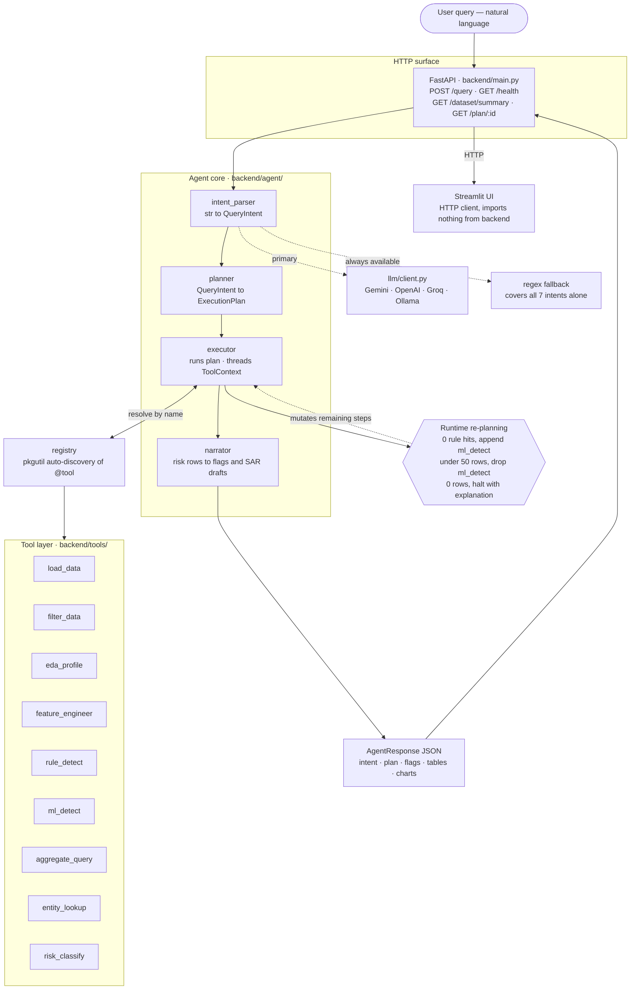
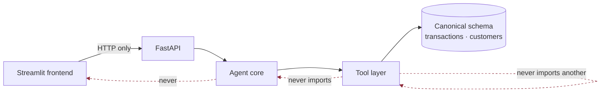
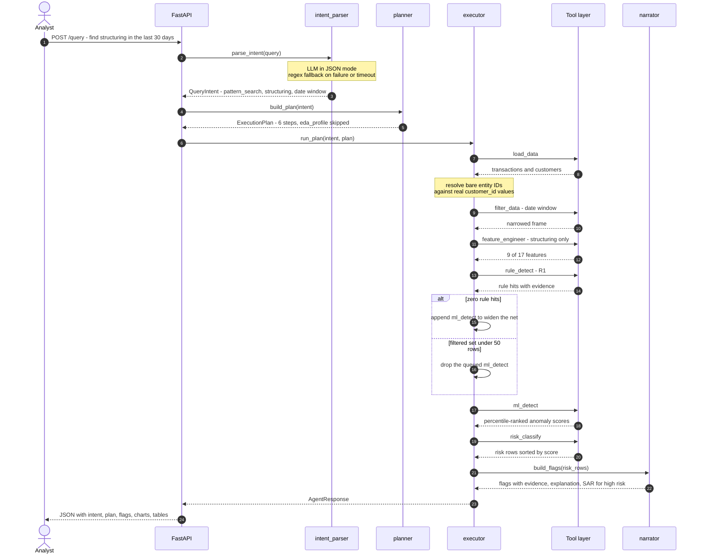
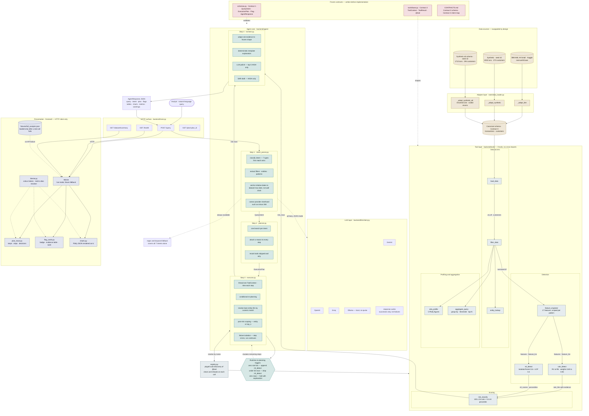

# ARCHITECTURE.md — Agent Design Detail

Companion to [README.md](../README.md) (the pitch) and [docs/CONTRACTS.md](CONTRACTS.md) (the frozen
interface, written first and unchanged in spirit throughout the build). This file explains *how* the
pieces fit together and *why* they're shaped the way they are.

---

## Component diagram



**The one rule that makes the two-person build possible**: dependencies flow **agent → tools, never the
reverse**. No tool imports `backend.agent.*`; no tool imports another tool; the Streamlit frontend imports
nothing from `backend/` at all — HTTP only.



---

## The four agent-core components

### 1. Intent parser (`backend/agent/intent_parser.py`)

`raw_query: str → QueryIntent`. LLM-first (`backend/llm/client.py`, JSON mode, provider-agnostic), with a
**complete regex/keyword fallback** that alone covers all 7 intents — this is the path actually exercised
in every test, since the LLM path has no live-key test yet (see README Limitations).

Key design points:
- **Relative dates** ("last 30 days") anchor to the *dataset's own max transaction date*
  (`_dataset_reference_date()`, cached per process), not wall-clock `date.today()` — the demo dataset is
  dated Jan–Mar 2025, so anchoring to real "today" would silently return zero results for the exact
  "last 30 days" query the problem brief itself uses as an example.
- **Entity IDs** are extracted two ways: a `C-`/`T-` prefixed alphanumeric token (real IDs aren't purely
  numeric — `C-STR02`, `C-N0001`) passes through as-is; a bare number with no prefix gets constructed into
  a plausible `C-#####` ID that `executor.py`'s `_resolve_entities()` later reconciles against the real
  dataset by numeric value.
- **Classification precedence** (first match wins, in this order): `explain_flag` → `entity_investigation`
  → `ranking` → `threshold_query` → `pattern_search` → `eda` → `full_analysis` fallback. E.g. a query
  naming both an entity and a pattern keyword resolves to `entity_investigation`, since a named entity is
  a more specific signal.

### 2. Planner (`backend/agent/planner.py`)

`QueryIntent → ExecutionPlan`. One branch per intent, implementing the mapping table in
[docs/CONTRACTS.md](CONTRACTS.md) Contract 4 exactly. Every `ToolCall` carries a `reason`; every
tool *not* included carries an entry in `tools_considered_but_skipped` with its own reason — this list is
what makes "the agent decided, it didn't just run a pipeline" a checkable claim rather than a marketing
line.

Tool call params are built to match what `backend/tools/*.py` **actually accept** — this mattered in
practice: several params (`filter_data`'s flattened `Filters` fields, `feature_engineer`'s `pattern_types`,
`aggregate_query`'s `group_by`/`agg_func`/`threshold`) were initially guessed differently and had to be
corrected once real tools existed to check against (see the Phase 6/7 history in
[TRACK_A_PROGRESS.md](TRACK_A_PROGRESS.md) if you want the full story).

### 2b. LLM planner (`backend/agent/llm_planner.py`, opt-in)

`build_plan` above is deterministic: the tool sequence inside each branch is a constant. With
`AML_LLM_PLANNER=1`, `plan_query()` puts an LLM planning step in front of it and the model selects the
tools itself. Three modules cooperate:

| Module | Job |
|---|---|
| `tool_schema.py` | Renders the tool catalog from each tool's own `_tool_description`/`_tool_params` — the metadata the `@tool` decorator has always recorded and nothing previously read. One reader, so the prompt cannot drift from what the tools accept. |
| `plan_validator.py` | Twelve rules (V0–V11) over the proposal: registry membership, dependency ordering, no duplicates, `load_data` first, ≤12 steps, declared param names, a stated reason per step. Collects **all** violations, not the first. |
| `llm_planner.py` | Prompt, fallback, and audit trail. |

Two design points worth stating explicitly:

**The deterministic planner is the floor, not the alternative.** Every failure path — LLM unavailable,
unparseable JSON, any validation rejection — returns `build_plan(intent)`. Contract 4 in
[CONTRACTS.md](CONTRACTS.md) is therefore still honoured as the guaranteed behaviour of this system; the
LLM can only do *better* than it for a given query, never something illegal. Contract 4 is unchanged and
was not edited for this feature.

**Legality (V0–V11) and answerability (V12) are different things.** V5–V7 mirror real preconditions in the
tool bodies (`rules.py` reads `ctx.artifacts["features"]`; `risk.py` reads `rule_hits`/`ml_scores`), so a
passing plan cannot fail on a missing artifact. V12 additionally requires the terminal tool each intent
needs to produce its answer.

V12 was not in the original design, which held that anything beyond dependency legality would mean
encoding the deterministic planner's opinions back into the validator. Measurement showed that was too
permissive: with V0–V11 alone a local 3B model reached **60% acceptance while only 7% of plans could
answer the query** — it had learned that shorter plans pass, because a truncated plan satisfies every
ordering rule vacuously. V12 constrains the plan's *output*, not the route to it: a `ranking` query that
cannot return a ranking is broken, not merely suboptimal. Which filters, which detectors, rules vs ML —
all still the model's call.

A legal, answerable but clumsy plan still passes, and should. Judging elegance is not a whitelist's job.

**Repair vs rejection.** Defects with exactly one correct fix and no judgement involved are repaired and
logged, not rejected: a missing or misplaced `load_data`, `filter_data`'s params when left empty,
`entity_lookup`'s `entity_id`. `load_data` moved into this category after measurement — it was 8 of 13
rejections, yet all eight deterministic branches start with it and no query exists where omitting it is
correct, so requiring the model to emit it tested nothing. Anything involving a real choice is never
repaired; a duplicated `load_data` is still rejected, because two of them signals confusion rather than an
omitted preamble.

The audit trail (`planner: source=` / `proposed =` / `rejected —` / `executed =`) goes into
`plan.decisions[]`, which the UI already renders, so this needed no frontend change. `executed` is
appended after the run and therefore includes the executor's own re-planning — that is how
proposed-vs-executed divergence stays visible.

`_tool_params` is only checked when non-empty: `backend/tools/_mocks.py` declares no param schemas, so
strict checking would reject every plan under `AML_USE_MOCKS=1`. An empty declaration means "unvalidated"
and emits a note, keeping the gap auditable rather than silent.

### 3. Executor (`backend/agent/executor.py`)

`(QueryIntent, ExecutionPlan) → AgentResponse`. Threads one `ToolContext` through every step, merging each
`ToolResult`'s `df`/`artifacts`/`tables`/`charts`/`metrics` and timing each step. **Never lets one tool's
failure break the response** — a raised exception or `ok=False` marks that step `"error"`, appends a
warning, and the run continues with whatever data survived.

Three behaviors live here specifically because they need data that only exists *after* a step has run
(the planner can't know these at plan-build time):

- **Conditional re-planning**: 0 rule hits → insert `ml_detect` next; <50 filtered rows → drop a queued
  `ml_detect`; 0 filtered rows → stop early with an explanatory summary.
- **Entity-ID resolution** (`_resolve_entities()`): right after `load_data` populates `ctx.customers`,
  reconciles any unresolved bare-number entity against the real dataset's `customer_id` values **by
  numeric id** (digits-only, integer comparison — not substring, which would false-match short numbers).
  Propagates the resolved ID into `intent.entities` and into any already-built `entity_lookup` step's
  params.
- **Post-`risk_classify` scoping**: `risk_classify` scores the whole population (it has no per-entity or
  top-N parameter), so `entity_investigation`/`explain_flag` filter `risk_rows` down to the requested
  entity, and `ranking` slices to `intent.top_n`, after the fact.

### 4. Narrator (`backend/agent/narrator.py`)

`risk_rows → Flag[]`. A deterministic template layer (`_build_evidence()` + `_explain()`) built directly
from each rule's evidence — **always accurate, always available**, since `rule_detect`'s evidence dicts
are rule-specific free-form dicts (structuring's fields differ from layering's — see
[AML_LOGIC.md](AML_LOGIC.md)), adapted into the frozen `Evidence` schema by pairing `evidence[i]` with
`triggered_rules[i]` positionally (how `risk_classify` builds them).

LLM polish is **capped to `HIGH`-risk flags only** — a `full_analysis` result can carry dozens of flags,
and one LLM call per flag would exhaust a free-tier rate limit on a single query for no real benefit (the
polish silently falls back to the identical template text on any LLM failure anyway). `HIGH` flags are
also the only ones getting a `sar_draft`, so this is where LLM value is actually concentrated.

---

## The frozen contracts (docs/CONTRACTS.md)

Three things, fixed before either half of this project was built, and unchanged since:

1. **`backend/schemas.py`** — every Pydantic model (`QueryIntent`, `ExecutionPlan`, `ToolCall`, `Flag`,
   `AgentResponse`, ...).
2. **`backend/tools/base.py`** — `ToolContext`, `ToolResult`, the `@tool` decorator every tool registers
   with.
3. **`backend/agent/registry.py`** — auto-discovers tools by walking `backend/tools/` with
   `pkgutil.iter_modules`, so adding a tool means adding a file, not editing a hand-maintained import list.

### The registry's one subtlety

`TOOLS` (in `backend/tools/base.py`) is a single global dict; a module's `@tool` decorators only execute
on that module's *first* import. `registry.load_tools(use_mocks=...)` therefore **clears `TOOLS` and
`importlib.reload()`s already-imported modules** on every call — without this, calling it more than once
with different `use_mocks` values in one process (which happens across a test session, not in normal
single-mode server operation) leaves some tool names on stale bindings from whichever mode last imported
them. Found via a full-suite test failure that only reproduced in specific file-import orderings.

---

## Intent → tool sequence (Contract 4, summarized)

| Intent | Sequence | Notably skipped |
|---|---|---|
| `full_analysis` | load → eda → features → rules → ml → risk | — |
| `pattern_search` | load → filter → features(scoped) → rules(scoped) → ml → risk | eda |
| `threshold_query` | load → filter → aggregate | features, ml, eda |
| `entity_investigation` | load → filter → entity_lookup → features → rules → ml → risk *(→ scoped to entity)* | eda |
| `ranking` | load → filter → features → rules → ml → risk *(→ sliced to top_n)* | eda |
| `eda` | load → filter → eda | features, rules, ml, risk |
| `explain_flag` | load → entity_lookup → features → rules → ml → risk *(→ scoped to entity)* | eda |

`explain_flag`'s inclusion of `load_data` is a deliberate deviation from Contract 4's original text
("reuse a cached run") — that mechanism was never actually wired to anything, so the intent always
returned empty. Scoring the entity fresh (same shape as `entity_investigation`, minus `filter_data`, since
"why was X flagged" implies no extra scoping) makes the feature actually answer the question.

Both single-entity intents run `ml_detect` despite asking about one customer, which looks wrong until you
read the rest of their plan: `feature_engineer` runs across the **whole population** so the resulting score
is comparable, and `ml_detect` therefore receives all 270 customers rather than one. They originally
skipped it — `WORKPLAN.md` §8 even pinned that as a definition-of-done item — and the effect was to zero
the ML half of Contract 5's formula. Every single-entity query returned exactly `100 × 0.6 ×
max_rule_weight`: C-STR02 scored **51.00 MEDIUM ("review")** when asked about directly and **89.84 HIGH
("report")** in a full sweep. Asking about a customer directly was the one query that understated their
risk, and it downgraded them out of the SAR-drafting tier.

Genuinely small samples are still handled, by the two guards that fire on data size rather than intent
name: the executor drops `ml_detect` when `filter_data` leaves under 50 rows, and `ml_detect` itself
no-ops below `IF_MIN_SAMPLES`. Plan divergence — the core agentic claim — is unaffected: `eda_profile`
stays out of both, `threshold_query` still skips ML entirely, and `eda` still runs no detection at all.

---

## Sequence: three contrasting queries

One request end to end first, then the three traces that show how much the shape changes per query.



**"Is customer 4521 suspicious?"** — bare number, entity_investigation
```
parse → entities=["C-04521"] (constructed guess, not yet a real ID)
plan  → load_data, filter_data, entity_lookup, feature_engineer, rule_detect, ml_detect,
        risk_classify        (eda_profile skipped — this is not exploration)
exec  → load_data runs → _resolve_entities() matches "04521" by numeric id against real
        customer_ids → resolves to e.g. "C-N0002" if a match exists, else leaves unresolved
      → features/rules/ml all run across the full population, so the score this entity gets
        is the same one a full sweep would give it
      → risk_classify scores everyone → executor filters risk_rows to just this one entity
narrate → 0 or 1 Flag, never a crash either way
```

**"Which customers made 10+ transactions under $10,000?"** — threshold_query
```
parse → filters.min_txn_count=10, filters.amount_max=10000.0
plan  → load_data, filter_data, aggregate_query   (ml_detect never even considered)
exec  → filter_data narrows to sub-$10k txns from senders with ≥10 such txns
      → aggregate_query groups by sender_id, counts, reports row_count
narrate → no Flags at all (by design — this intent skips risk_classify entirely);
          summary states the count directly from aggregate_query's metrics
```

**"Analyse this dataset for suspicious activity"** — full_analysis
```
parse → no filters/entities, full_analysis
plan  → all 6 tools, nothing skipped
exec  → eda_profile runs alongside detection; rule_detect finds hits across R1-R7;
        ml_detect scores every customer; risk_classify fuses both signals
narrate → dozens of Flags across HIGH/MEDIUM/LOW, each with its own evidence-based explanation
```

---

## Where to look for more detail

- **Rule definitions, thresholds, regulatory justification**: [AML_LOGIC.md](AML_LOGIC.md)
- **Dataset schema, sources, synthetic generation logic**: [DATA_CARD.md](DATA_CARD.md)
- **The full frozen interface**: [docs/CONTRACTS.md](CONTRACTS.md)
- **Build history, what was fixed and why, test counts over time**: [TRACK_A_PROGRESS.md](TRACK_A_PROGRESS.md)
- **The two-person parallel-build plan this repo followed**: [WORKPLAN.md](WORKPLAN.md)

---

## Complete system reference

Everything in one view — data sources through adapters, agent-core internals, the artifact handshake
between tools, the frozen contracts, and the frontend. This is a reference diagram, not a teaching one:
the three diagrams above each carry a single idea, while this one is for when you want the whole surface
at once.


