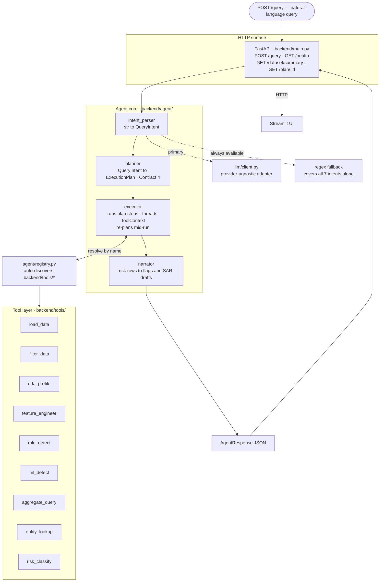
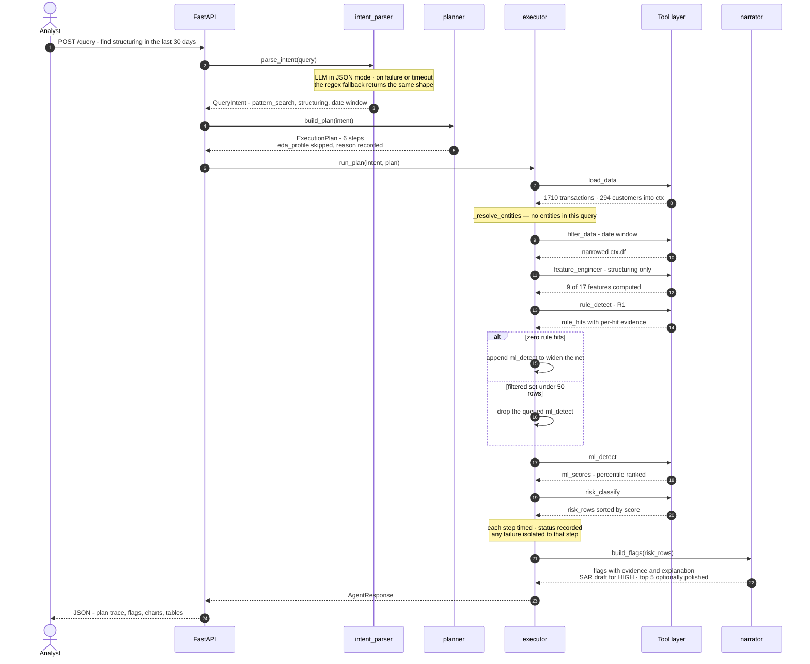
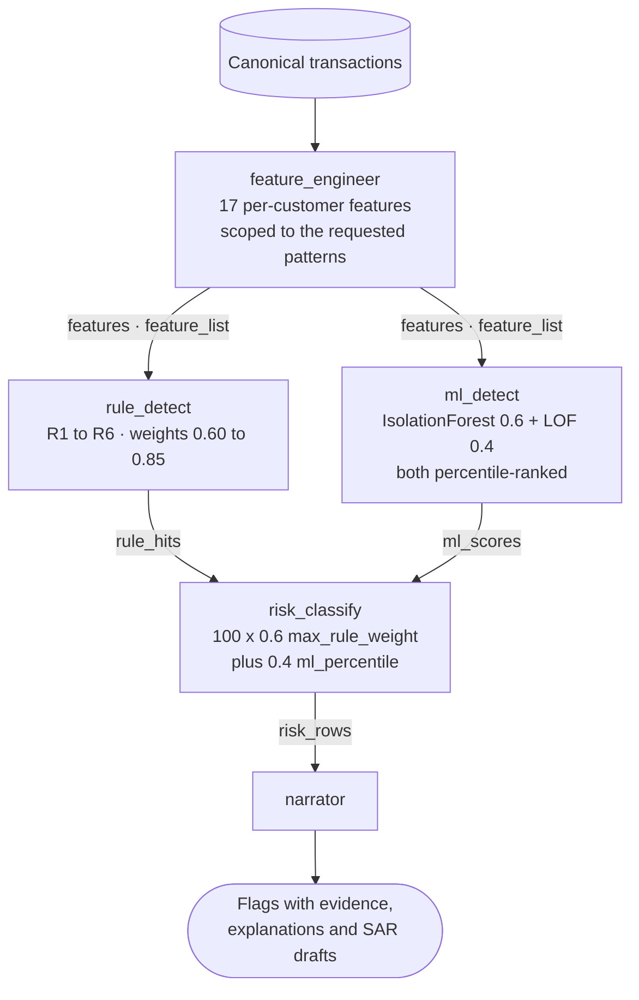

# Detailed Documentation — AI-Powered Suspicious Activity Detection

Complete technical documentation for the AML detection agent: **platform architecture**, **analysis
algorithms**, and **user interface design**.

This document is self-contained — it can be read start to finish without opening another file. Where
exhaustive detail exists elsewhere (per-rule regulatory citations, field-by-field dataset preprocessing),
the relevant deep-dive document is linked at the end of the section.

---

## Table of contents

1. [System overview](#1-system-overview)
2. [Platform architecture](#2-platform-architecture)
   - [2.1 Design principles](#21-design-principles)
   - [2.2 Layer map](#22-layer-map)
   - [2.3 The agent core](#23-the-agent-core)
   - [2.4 The tool layer and registry](#24-the-tool-layer-and-registry)
   - [2.5 Data contracts](#25-data-contracts)
   - [2.6 Request lifecycle](#26-request-lifecycle)
   - [2.7 API surface](#27-api-surface)
3. [Analysis algorithms](#3-analysis-algorithms)
   - [3.1 Detection pipeline overview](#31-detection-pipeline-overview)
   - [3.2 Feature engineering](#32-feature-engineering)
   - [3.3 Rule engine (R1–R7)](#33-rule-engine-r1r7)
   - [3.4 ML anomaly detection](#34-ml-anomaly-detection)
   - [3.5 Score fusion and risk banding](#35-score-fusion-and-risk-banding)
   - [3.6 Explanation and SAR generation](#36-explanation-and-sar-generation)
4. [User interface design](#4-user-interface-design)
   - [4.1 Design goals](#41-design-goals)
   - [4.2 Information hierarchy](#42-information-hierarchy)
   - [4.3 Design system](#43-design-system)
   - [4.4 Component anatomy](#44-component-anatomy)
   - [4.5 Dual-mode operation](#45-dual-mode-operation)
   - [4.6 Accessibility and colour safety](#46-accessibility-and-colour-safety)
   - [4.7 Frontend/backend boundary](#47-frontendbackend-boundary)
5. [Configuration and deployment](#5-configuration-and-deployment)
6. [Deep-dive references](#6-deep-dive-references)

---

## 1. System overview

A natural-language compliance query goes in. The agent parses intent, **builds a query-specific execution
plan**, runs only the tools that plan requires, and returns risk-scored, explained, escalation-tagged AML
flags — with the plan itself surfaced to the user so a reviewer can audit exactly what the agent decided
to do and why.

The defining property is that this is **not a fixed pipeline**. Two different queries produce two
genuinely different tool sequences, and the system logs every tool it chose *not* to run, with a reason.

| | |
|---|---|
| **Input** | Natural-language query (`"Find structuring patterns in the last 30 days"`) |
| **Output** | `AgentResponse` — intent, execution plan, risk-scored flags, evidence, explanations, SAR drafts, charts, tables |
| **Agent core** | 4 components: intent parser → planner → executor → narrator |
| **Tool layer** | 9 auto-discovered tools |
| **Intents** | 7 (`full_analysis`, `pattern_search`, `threshold_query`, `entity_investigation`, `ranking`, `eda`, `explain_flag`) |
| **Detection** | 7 rules (R1–R7) + 2 unsupervised ML models, fused into one 0–100 risk score |
| **Features** | 17 per-customer AML features, computed on demand per pattern |
| **Test suite** | 208 tests (`pytest tests/`) |

---

## 2. Platform architecture

### 2.1 Design principles

Four constraints shaped the architecture, and every structural decision follows from them:

**1. Dependencies flow one way: agent → tools, never the reverse.**
No tool imports `backend.agent.*`. No tool imports another tool. The frontend imports nothing from
`backend/` at all — it talks HTTP only. This makes each layer independently testable and independently
replaceable.

**2. Interfaces are frozen before implementation.**
`backend/schemas.py` (Pydantic models), `backend/tools/base.py` (`ToolContext`, `ToolResult`, `@tool`),
and `docs/CONTRACTS.md` were written first and treated as read-only ground truth thereafter. This is what
allowed the agent core and the detection tools to be built in parallel against a stable target.

**3. The plan is a first-class output, not an implementation detail.**
`ExecutionPlan` is part of the response schema, not a log line. Steps, skip reasons, and mid-run
re-planning decisions are all persisted and rendered.

**4. Never crash on an expected condition.**
Zero matching rows, an entity that doesn't exist, too few samples for ML, an LLM timeout — each returns a
successful response carrying an explanation, not an exception. Tools return `ToolResult(ok=False, error=...)`
rather than raising; the executor degrades a failed step to `status="error"` and continues with whatever
data survived.

### 2.2 Layer map



### 2.3 The agent core

#### 2.3.1 Intent parser — `backend/agent/intent_parser.py`

`raw_query: str → QueryIntent`

LLM-first with a **complete regex/keyword fallback that alone covers all 7 intents**. The fallback is not
a degraded mode — it is a fully functional parser, which is why the system runs with no API key at all.

Three design points worth calling out:

- **Relative dates anchor to the dataset, not wall-clock time.** `"last 30 days"` resolves against the
  dataset's own maximum transaction date (cached per process), not `date.today()`. The demo data is dated
  Jan–Mar 2025; anchoring to real "today" would silently return zero rows for exactly the query the
  problem brief uses as its example. LLM providers frequently return relative shorthand (`"-30d"`,
  `"1 month ago"`) instead of ISO dates, so `_coerce_relative_date()` resolves those rather than failing
  validation.
- **Entity IDs are extracted two ways.** A prefixed token (`C-STR02`, `C-N0001`) passes through as-is. A
  bare number is constructed into a plausible `C-#####` ID that the executor later reconciles against real
  dataset IDs by numeric value.
- **Classification precedence is explicit** (first match wins): `explain_flag` → `entity_investigation` →
  `ranking` → `threshold_query` → `pattern_search` → `eda` → `full_analysis` (fallback). A query naming
  both an entity and a pattern resolves to `entity_investigation`, because a named entity is the more
  specific signal.

The LLM layer (`backend/llm/client.py`) is provider-agnostic — Gemini, OpenAI, Groq, or local Ollama
behind one adapter, in JSON mode. Successful completions are cached (failures are not), so re-running the
same query during a demo costs no additional quota.

#### 2.3.2 Planner — `backend/agent/planner.py`

`QueryIntent → ExecutionPlan`

One branch per intent, implementing the Contract 4 mapping exactly:

| Intent | Tool sequence | Deliberately skipped |
|---|---|---|
| `full_analysis` | load → eda → features → rules → ml → risk | — |
| `pattern_search` | load → filter → features *(scoped)* → rules *(scoped)* → ml → risk | `eda_profile` |
| `threshold_query` | load → filter → aggregate | `feature_engineer`, `ml_detect`, `eda_profile` |
| `entity_investigation` | load → filter → entity_lookup → features → rules → ml → risk | `eda_profile` |
| `ranking` | load → filter → features → rules → ml → risk *(sliced to `top_n`)* | `eda_profile` |
| `eda` | load → filter → eda | `feature_engineer`, `rule_detect`, `ml_detect`, `risk_classify` |
| `explain_flag` | load → entity_lookup → features → rules → ml → risk *(scoped to entity)* | `eda_profile` |

Every `ToolCall` carries a `reason`. Every tool *not* included gets an entry in
`tools_considered_but_skipped` with its own reason. That second list is what converts "the agent decided"
from a marketing claim into a checkable one — and it is asserted by automated tests
(`tests/test_planner.py`, `tests/test_integration.py`) that verify three representative queries produce
genuinely different plans.

Two notable choices:

- **`ml_detect` runs even for single-entity intents**, which reads as a mistake until you look at what the
  rest of the plan does. `feature_engineer` in those plans computes across the *whole population* — the
  step's own reason says "required for a comparable risk score" — so `ml_detect` receives all 270
  customers, not the one being asked about. The planner used to skip it on the reasoning that "a single
  entity is not a sample you can fit an anomaly model on"; that reasoning described a plan the planner
  wasn't building. The effect was to zero the ML half of the fusion formula, so every single-entity query
  returned exactly `100 × 0.6 × max_rule_weight`. C-STR02 came back **51.00 MEDIUM ("review")** when asked
  about directly and **89.84 HIGH ("report")** in a full sweep — the direct question was the one query
  that understated a customer's risk, and it pushed them below the SAR-drafting threshold.

  The sample-size concern was real, but it belongs on the size of the data rather than the name of the
  intent, and it was already implemented twice: the executor drops `ml_detect` when `filter_data` leaves
  under 50 rows, and `ml_detect` itself returns empty scores below `IF_MIN_SAMPLES`. Both still fire.
- **`explain_flag` re-runs `load_data`** rather than reusing a cached run. Contract 4 originally specified
  cache reuse, but that mechanism was never wired to anything, so the intent always returned empty.
  Scoring fresh is simpler and always correct — the documented trade-off is that it can't explain a flag
  from a run that used different filters.

#### 2.3.3 Executor — `backend/agent/executor.py`

`(QueryIntent, ExecutionPlan) → AgentResponse`

Threads one `ToolContext` through every step, merging each `ToolResult`'s `df` / `artifacts` / `tables` /
`charts` / `metrics` and timing each step in milliseconds.

Three behaviours live here specifically because they depend on data that only exists *after* a step has
run — the planner cannot know them at plan-build time:

**Conditional re-planning.** The plan is mutated mid-flight based on observed results:

| Observed condition | Re-planning action |
|---|---|
| `rule_detect` returns 0 hits | Append `ml_detect` — widen the net rather than report "nothing found" |
| Filtered subset < 50 rows | Drop a queued `ml_detect` — insufficient sample for a meaningful anomaly model |
| `filter_data` returns 0 rows | Stop early with an explanatory summary instead of running the remaining tools against an empty frame |

Each of these appends a human-readable string to `plan.decisions[]`, which the UI renders verbatim.

**Entity-ID resolution** (`_resolve_entities()`). Immediately after `load_data` populates `ctx.customers`,
any unresolved bare-number entity is reconciled against real `customer_id` values by **numeric comparison**
(digits extracted, compared as integers — deliberately not substring matching, which would false-match
short numbers). The resolved ID is propagated back into `intent.entities` and into any already-built
`entity_lookup` step's params.

**Post-`risk_classify` scoping.** `risk_classify` scores the entire population — it has no per-entity or
top-N parameter by design. The executor therefore filters `risk_rows` down to the requested entity for
`entity_investigation` / `explain_flag`, and slices to `intent.top_n` for `ranking`, after the fact.

**Failure isolation.** A raised exception or an `ok=False` result marks that one step `"error"`, appends a
warning to the response, and lets the run continue. One tool failing never produces a failed response.

#### 2.3.4 Narrator — `backend/agent/narrator.py`

`risk_rows → Flag[]`

Converts scored rows into user-facing flags with evidence, explanations, and SAR drafts. Covered in full
in [§3.6](#36-explanation-and-sar-generation).

### 2.4 The tool layer and registry

Nine tools, each a single function decorated with `@tool` and living in its own module under
`backend/tools/`:

| Tool | Responsibility |
|---|---|
| `load_data` | Load a dataset and convert it to the canonical schema; emits transactions + customers, plus the unfiltered reference frame ML percentiles are ranked against |
| `filter_data` | Composable filters (date, country, txn type, amount, min txn count, segment); never mutates in place |
| `eda_profile` | Profile stats + 5 Plotly figures (amount histogram, threshold proximity, txn type, country, volume timeseries) |
| `feature_engineer` | 17 per-customer AML features, scoped to requested patterns |
| `rule_detect` | Rules R1–R7; emits per-rule evidence dicts |
| `ml_detect` | IsolationForest + LocalOutlierFactor anomaly scoring, ranked against the fixed full population |
| `aggregate_query` | Deterministic group-by/aggregate with threshold and top-N |
| `entity_lookup` | One customer's profile + recent transaction table |
| `risk_classify` | Fuses rule hits and ML scores into a 0–100 risk score, level, and escalation |

**Auto-discovery.** `backend/agent/registry.py` walks `backend/tools/` with `pkgutil.iter_modules` and
registers everything carrying `@tool`. Adding a tool means adding a file — there is no hand-maintained
import list to forget to update.

**One subtlety worth documenting.** `TOOLS` in `backend/tools/base.py` is a single global dict, and a
module's `@tool` decorators only execute on that module's *first* import. `registry.load_tools()`
therefore clears `TOOLS` and `importlib.reload()`s already-imported modules on every call. Without this,
calling it more than once with different `use_mocks` values in a single process (which happens across a
test session, though not in normal single-mode server operation) leaves some tool names bound to
whichever mode imported them last. This was found via a full-suite failure that only reproduced under
specific file-import orderings.

**Mock mode.** `backend/tools/_mocks.py` provides stand-ins with identical signatures, selected by
`AML_USE_MOCKS=1`. This existed so the agent core could be built and tested before the real detection
tools were written; it remains useful for isolating agent-core behaviour in tests.

### 2.5 Data contracts

Three frozen interfaces, fixed before implementation and unchanged since:

**Contract 0 — canonical schema.** Every dataset is adapted into one shape before any detection code sees
it: `transactions` (`txn_id`, `timestamp`, `sender_id`, `receiver_id`, `amount`, `currency`, `txn_type`,
`channel`, `sender_country`, `receiver_country`, `is_cross_border`, …) and `customers`. This is what makes
datasets swappable — the IBM Kaggle set, the primary synthetic set, and the alt-schema synthetic set all
reach the same canonical frame through different adapters.

**Contract 1 — `backend/schemas.py`.** The Pydantic response models:

```
QueryIntent    raw_query, intent, filters, entities, pattern_types, top_n, confidence, parsed_by
ToolCall       tool, params, reason, status, duration_ms, skip_reason
ExecutionPlan  plan_id, steps[], decisions[], tools_considered_but_skipped[]
Evidence       rule_id, feature, value, threshold, note
Flag           entity_type, entity_id, risk_score, risk_level, escalation, patterns[],
               triggered_rules[], ml_score, evidence[], explanation, sar_draft
AgentResponse  query, intent, plan, flags[], tables{}, charts{}, metrics{}, summary, warnings[]
```

**Contract 2 — `backend/tools/base.py`.** `ToolContext` (the mutable state threaded through a run),
`ToolResult` (what every tool returns: `ok`, `df`, `artifacts`, `tables`, `charts`, `metrics`, `notes`,
`error`), and the `@tool` decorator. Tools hand data to each other only through agreed `artifacts` keys —
`features`, `feature_list`, `rule_hits`, `ml_scores`, `risk_rows`, `customers`, `entity_profile`, `eda`.

### 2.6 Request lifecycle

End-to-end trace of `"Find structuring patterns in the last 30 days"`:



### 2.7 API surface

| Endpoint | Method | Purpose |
|---|---|---|
| `/query` | POST | Main entry point. Body `{"query": str, "dataset": str?}` → `AgentResponse` |
| `/health` | GET | Liveness + `llm_available` + `mocks` flags — drives the UI's status indicators |
| `/dataset/summary` | GET | Row count, customer count, schema columns — drives the sidebar |
| `/plan/{plan_id}` | GET | Retrieve a cached `AgentResponse` by plan ID |

---

## 3. Analysis algorithms

### 3.1 Detection pipeline overview

Detection is **hybrid**: deterministic rules provide precision and explainability, unsupervised ML
provides recall against novel patterns, and a weighted fusion produces one auditable score.



Why both halves are needed: rules alone cannot catch a pattern nobody wrote a rule for, and an anomaly
model alone cannot tell a compliance officer *why* something is suspicious in language that survives an
audit. Each covers the other's weakness, and the fusion weights (0.6 rule / 0.4 ML) reflect that rule
evidence is the more defensible signal.

### 3.2 Feature engineering

`backend/tools/features.py` computes **17 per-customer features**, indexed by `customer_id`.

Features are computed **on demand per pattern**, not all at once. The planner passes `pattern_types`, and
`_requested_features()` returns the union of what those patterns need. A `pattern_search` for structuring
computes 9 features; a `full_analysis` computes all 17. This is a meaningful cost saving on the most
expensive step in the pipeline.

| Feature | Definition |
|---|---|
| `rolling_1d_sum` / `_count` | Outbound amount / transaction count in a 1-day rolling window |
| `rolling_7d_sum` / `_count` | Same, 7-day window |
| `rolling_30d_sum` / `_count` | Same, 30-day window |
| `pct_just_below_threshold` | Fraction of transactions in the **$9,000.00–$9,999.99** band |
| `amount_zscore_90d` | Self-deviation z-score vs. the customer's own 90-day history |
| `velocity_txns_per_hour` | Peak transaction rate |
| `velocity_counterparties_per_day` | Distinct counterparties per day |
| `rapid_cashout_ratio` | Cash withdrawn shortly after an inbound transfer, over inbound amount |
| `round_amount_ratio` | Fraction of amounts divisible by **$500** (remainder < $1) |
| `night_hours_ratio` | Fraction of transactions in **22:00–05:59 UTC** |
| `new_counterparty_ratio` | Fraction of transactions to first-seen counterparties |
| `cross_border_count` / `_ratio` | Cross-border transaction volume |
| `pass_through_ratio` | `min(in, out) / max(in, out)` over a 48-hour sliding window — the defining layering signal |

**Design decisions and their rationale:**

- **Rolling windows are sender-side only.** Structuring, smurfing, and rapid cash-out are outbound
  behaviours. Inbound amounts are tracked separately, used only by `rapid_cashout_ratio`. This is a real,
  documented scope decision — it is also the direct cause of the receiver-side recall gap noted in the
  README's Results section.
- **The threshold band is $9,000–$9,999.99, not "large transactions."** This is anchored to the Bank
  Secrecy Act's $10,000 Currency Transaction Report threshold. Structuring (31 U.S.C. § 5324) is
  specifically the act of splitting to stay *under* it.
- **z-score falls back to 0.0 below 3 transactions in the 90-day window.** A z-score computed from one or
  two observations is noise; emitting 0.0 (neutral) is safer than emitting a spuriously large deviation.
- **Round-amount unit is $500 with a <$1 remainder tolerance**, floating-point safe.
- **Night hours are UTC-based.** Documented limitation: the data is timezone-naive, so customers outside
  UTC are approximated.

**Pattern → feature mapping:**

| Pattern | Features computed |
|---|---|
| `structuring` | rolling 1d/7d/30d, `pct_just_below_threshold`, `amount_zscore_90d`, `round_amount_ratio` |
| `smurfing` | rolling 1d/7d, `pct_just_below_threshold`, `amount_zscore_90d`, both velocity features, `new_counterparty_ratio`, `round_amount_ratio` |
| `layering` | rolling 7d/30d, `amount_zscore_90d`, `velocity_counterparties_per_day`, `night_hours_ratio`, `new_counterparty_ratio`, cross-border count + ratio, `pass_through_ratio` |
| `rapid_cashout` | rolling 1d, `amount_zscore_90d`, `velocity_txns_per_hour`, `rapid_cashout_ratio`, `night_hours_ratio` |
| `velocity` | rolling 1d, `velocity_txns_per_hour`, `amount_zscore_90d` |
| `dormant_reactivation` | rolling 7d, `amount_zscore_90d` (dormancy gap computed directly from timestamps) |

### 3.3 Rule engine (R1–R7)

`backend/tools/rules.py`. Each rule emits a **rule-specific evidence dict** — structuring's fields differ
from layering's — which flows through unchanged to the explanation layer. Nothing is summarised away
before a human sees it.

| Rule | Pattern | Weight | Core thresholds |
|---|---|---|---|
| **R1** | Structuring | `0.85` | ≥ 3 transactions in the $9,000–$9,999.99 band within 7 days, **and** `pct_just_below_threshold` ≥ 0.30 |
| **R2** | Smurfing (fan-out) | `0.75` | ≥ 5 distinct receivers in 48h, amounts in the $7,000–$9,999.99 band |
| **R3** | Layering | `0.80` | ≥ 3-hop wire/transfer chain, `pass_through_ratio` ≥ 0.70 per intermediate node, ≥ 1 cross-border hop, 48h window, ±30% amount tolerance |
| **R4** | Rapid cash-out | `0.75` | Inbound ≥ $10,000, ≥ 3 cash withdrawals, cash-out ratio ≥ 0.50, within 24h, via ATM or branch |
| **R5** | High velocity | `0.65` | ≥ 2.0 txns/hour **and** amount z-score ≥ 3.0 |
| **R6** | Dormant reactivation | `0.60` | ≥ 60 days dormant, then ≥ 3 transactions in 7 days with z-score ≥ 2.0 |
| **R7** | Structuring, receiver side | `0.75` | ≥ 2 *inbound* transactions in the $9,000–$9,999.99 band from a **single** counterparty within 7 days |

**Why every rule is a conjunction, never a single threshold.** R1 does not fire on "any transaction over
$9,000" — that naive rule flags 96% of customers in the demo dataset. It requires a *pattern*: repeated
sub-threshold activity concentrated in a short window, as a proportion of that customer's behaviour. This
is the single largest source of the system's false-positive reduction.

**R3 has explicit computational guards.** Chain search is the one place this pipeline can blow up
combinatorially, so layering detection is bounded on three axes: maximum hop depth of 5, a 0.20s
wall-clock budget per chain start, and a 500-node ceiling on the wire/transfer subgraph before the search
is abandoned. The 48-hour window does most of the work by itself, since it truncates each node's
candidate continuations. These are cost controls, not detection logic — but without them a dense dataset
makes the query hang rather than return.

> The search used to enumerate `all_simple_paths` between (source, sink) pairs, which needed two further
> caps — 50 paths per pair and 25 transactions per edge. Both went away with the pair enumeration when
> chain origin became a windowed property; see [AFTER_THE_DEADLINE.md](AFTER_THE_DEADLINE.md).

**Weights are calibrated to evidence strength, not pattern severity.** R1 carries the highest weight
(0.85) because sub-threshold clustering is close to unambiguous. R6 carries the lowest (0.60) because
dormant reactivation has many innocent explanations — an inheritance, a returning expatriate, a seasonal
business. R7 sits at 0.75 rather than matching R1: receiving structured deposits is a strong signal, but
attribution is weaker than for the sender, since the account holder may be a willing mule or an unwitting
recipient. A rule-only R7 hit therefore scores 45 — MEDIUM, "review" — reaching an analyst without
auto-drafting a SAR.

**R7 is the only receiver-side rule, and it is deliberately not fan-in detection.** Every other rule and
all 17 features evaluate outbound behaviour, which left the beneficiary accounts of a structuring scheme
invisible: 63 of 114 labelled customers on the sample dataset appear only as receivers. The obvious fix
is a classic funnel-account rule — many distinct senders converging on one account — and it was tested
and rejected because it does not discriminate on this data. Receive-only positives average **7.6 distinct
inbound counterparties against a population average of 6.9**, and in any 48-hour window both peak at 4.
What does separate cleanly is the *pair* signal in R7: repeated band-range deposits from one specific
sender, where no true negative in the dataset exceeds a single such transaction. R7 recovers 12 of the 63;
the remaining 51 receive one labelled transaction each and are not distinguishable from ordinary
counterparties of a bad actor.

Full regulatory citations (BSA, FATF Recommendations 1/3/10, FinCEN SAR requirements), per-rule
worked examples, and threshold justification: **[AML_LOGIC.md](AML_LOGIC.md)**.

### 3.4 ML anomaly detection

`backend/tools/ml_detect.py`. Two unsupervised models, deliberately **unsupervised** — production AML has
no reliable labels, so a supervised classifier would be trained on the very rule outputs it is supposed to
complement.

**Preprocessing.**
1. Select columns from `artifacts["feature_list"]` that are present in the feature frame.
2. Exclude metadata columns (`zscore_n_samples` is a sample count, not a signal).
3. **Drop zero-variance columns** — a constant feature contributes nothing but distorts distance metrics.
4. Fill NaN with 0.0, then apply `StandardScaler`. Both models are distance-sensitive and the raw features
   span wildly different scales (dollar sums vs. 0–1 ratios), so scaling is mandatory rather than optional.

**Primary model — IsolationForest.**

| Parameter | Value | Rationale |
|---|---|---|
| `contamination` | `0.05` | Expected anomaly fraction; matches realistic AML alert rates |
| `n_estimators` | `100` | sklearn default; no measured benefit from more on this data size |
| `random_state` | `42` | Reproducibility — the same input must produce the same score |
| Minimum samples | `10` | Absolute floor below which the model is meaningless |

Chosen because it isolates anomalies by random partitioning rather than modelling normality, which suits a
high-dimensional, mixed-scale feature space with no clean distributional assumption.

**Secondary model — LocalOutlierFactor.**

| Parameter | Value | Rationale |
|---|---|---|
| `n_neighbors` | `20` (capped at `n−1`) | Standard density-estimation neighbourhood |
| Minimum samples | `30` | Below this, KNN density estimates are degenerate |
| `novelty` | `False` | Fitting and scoring the same population |

LOF catches **local density anomalies** that IsolationForest misses — an entity that is unremarkable
globally but a clear outlier within its own behavioural cluster.

**Score fusion.** Both models produce raw scores on incomparable scales, so each is converted to a
**percentile rank in [0, 1]** before combining:

```
fused_percentile = 0.60 × IF_percentile + 0.40 × LOF_percentile        (n ≥ 30)
fused_percentile = IF_percentile                                        (10 ≤ n < 30, LOF skipped)
ml_scores = []                                                          (n < 10, with an explanatory note)
```

Percentile-ranking before fusing is what makes the weights meaningful — raw `decision_function` output
and `negative_outlier_factor_` are not on a common scale and averaging them directly would be arbitrary.

**What the percentile is ranked against.** A percentile is only meaningful relative to a population, and
the choice of population turns out to matter more than the choice of model. Both models are fitted and
ranked on `artifacts["features_reference"]` — the **full customer set, before any filtering** — and each
entity's percentile is then looked up for whatever subset the query asked about.

The alternative, ranking inside the query's own filtered cohort, is what the system originally did, and it
made a customer's risk score a function of the analyst's typing rather than of the customer's behaviour.
Measured on the sample dataset: adding `amount_min=5000` to a structuring search moved percentiles by up
to **0.73** and pushed **four customers across a risk band**. A threshold that decides whether a SAR gets
drafted cannot move because someone narrowed their search.

The trade-off is accepted deliberately and is not free — the ML term is now insensitive to the query
window, so a customer who is unremarkable across the full dataset but anomalous within a narrow one no
longer registers on the ML half. Rules still evaluate the filtered frame and still fire on them. Stability
was judged the more important property for a score attached to an escalation decision.

Scoping is applied to the **output**, not the ranking: `ml_scores` is emitted for every customer appearing
in the working frame as sender *or* receiver. The receiver half matters — `feature_engineer` indexes on
senders, so scoping ML output to the feature index silently dropped receiver-side R7 hits and defaulted
them to a percentile of 0.0, reintroducing exactly the filter-dependence being removed.

**Explainability without SHAP.** For each entity, the top 3 contributing features are reported, ranked by
deviation from the peer median:

```
contribution(feature) = |entity_value − column_median| / column_std
```

This is a deliberate engineering trade-off. SHAP would be more rigorous, but it is slow, adds a heavy
dependency, and — critically — the ML score is only 40% of the final risk score, with the rule evidence
carrying the explanatory load. A cheap, always-available peer-deviation ranking is proportionate to how
much weight the ML signal actually carries.

**Graceful degradation.** Below the sample floor, or with no usable features after variance filtering,
`ml_detect` returns `ok=True` with empty `ml_scores` and a note explaining why. It never raises, and it
never blocks the rest of the pipeline.

### 3.5 Score fusion and risk banding

`backend/tools/risk.py` implements Contract 5:

```
risk_score = 100 × (0.60 × max_rule_weight + 0.40 × ml_percentile)
```

clamped to [0, 100].

| Risk score | Level | Escalation | Meaning |
|---|---|---|---|
| ≥ 70 | `high` | `report` | SAR draft generated; escalate to compliance |
| 40–69 | `medium` | `review` | Analyst review queue |
| 15–39 | `low` | `monitor` | Watchlist, no immediate action |
| < 15 | `none` | `no_action` | Below actionable threshold |

**Three fusion decisions that are not obvious from the formula:**

**1. Rule weight is `max`, not `sum`.** A customer triggering R1 (0.85) and R3 (0.80) scores on 0.85, not
1.65. Summing would let multiple weak signals manufacture a HIGH-risk flag, and would make the score
depend on how finely the rule set happens to be subdivided. Both rules are still surfaced in
`triggered_rules` and both evidence dicts reach the explanation — the score is capped, the transparency is
not.

**2. ML-only entities need percentile ≥ 0.95 and cap at MEDIUM.** An entity with no rule hits enters the
result set only if it is in the top 5% of anomaly scores. With `max_rule_weight = 0`, its ceiling is
`100 × 0.4 × 1.0 = 40` — the bottom of the MEDIUM band. **An entity can never reach HIGH, and therefore
never trigger a SAR draft, on an ML signal alone.** Filing a regulatory report requires stateable,
rule-based evidence; "the anomaly model disliked it" is not that.

**3. Rule hits alone can reach HIGH.** R1 at 0.85 with zero ML corroboration scores 51 (MEDIUM); with a
top-decile ML percentile it reaches ~85 (HIGH). Rule evidence and ML corroboration together are what
produce a report-tier flag.

### 3.6 Explanation and SAR generation

`backend/agent/narrator.py` converts scored rows into user-facing flags.

**Evidence adaptation.** `rule_detect` emits free-form, rule-specific evidence dicts. The narrator adapts
these into the frozen `Evidence` schema by pairing `evidence[i]` with `triggered_rules[i]` positionally —
the ordering guaranteed by how `risk_classify` constructs them. Values are formatted by type: floats in
[0,1] render as percentages, other floats with thousands separators, lists truncated to their first 5
elements.

**Deterministic template first.** The explanation is built from the actual evidence notes of the rules
that fired. It is **always accurate and always available** — no LLM required. If no rule fired and the
flag came from ML, the template names the percentile and the top contributing features instead.

**LLM polish is strictly capped.** Optional rewriting into analyst-facing prose applies only to the **top
5 HIGH-risk flags** (`llm_polish_max_flags`, configurable), never to MEDIUM/LOW, and never past the cap.
The reason is measured, not theoretical: a `full_analysis` run producing 23 HIGH flags took **144 seconds**
against local Ollama at one call per flag, against a 60-second frontend timeout. Every flag past the cap
ships the template text, which is already specific and accurate. Any LLM failure silently falls back to
the identical template.

The polish prompt explicitly instructs the model to use only the supplied facts and never invent numbers —
the template text is passed in as the sole source, so the model is rewriting, not reasoning.

**SAR drafts are generated for HIGH-risk flags only**, containing entity ID, risk score, patterns,
detection basis (rule IDs), the explanation, and a recommended action. They are drafts for human review —
FinCEN filing is a human decision, and the system is explicit about that boundary.

---

## 4. User interface design

`frontend/` — Streamlit + Plotly. Owner: Track B.

### 4.1 Design goals

The UI has one job that outranks the others: **make the agent's reasoning inspectable.** A compliance
analyst cannot act on a risk score they cannot interrogate, and the project's core claim — that this
plans rather than pipelines — is only credible if the plan is visible.

Four goals, in priority order:

1. **Show the reasoning, not just the result.** The execution plan is a primary UI surface, not a debug view.
2. **Every flag is drillable to evidence.** Score → rules → raw evidence values → SAR draft, without leaving the card.
3. **Never block on a backend failure.** The demo must survive an API that isn't running.
4. **Read as compliance software.** Restrained, dense, professional — an analyst tool, not a dashboard demo.

### 4.2 Information hierarchy

```
┌──────────────┬──────────────────────────────────────────────────────┐
│              │  AML Suspicious Activity Detection        (gradient)   │
│  SIDEBAR     │  Natural-language queries · Adaptive plans · …         │
│              ├──────────────────────────────────────────────────────┤
│  API status  │  💬 Query                                              │
│  LLM status  │  ┌────────────────────────────────────────────────┐   │
│  Mocks flag  │  │ text area                                       │   │
│              │  └────────────────────────────────────────────────┘   │
│  ─ Dataset ─ │  [🔍 Run Query]                                        │
│  Transactions│  Quick queries: [Full] [Entity] [Threshold] [Pattern]  │
│    1,710     │                 [Ranking] [Exploratory]                │
│  Customers   ├──────────────────────────────────────────────────────┤
│    294       │  Query + Summary                              (card)   │
│  ▸ Schema    ├──────────────────────────────────────────────────────┤
│              │  KPI ROW  Txns │ Custs │ Flags │ High │ Med │ Low     │
│              │  Risk distribution bar                                 │
│  ─ About ─   ├──────────────────────────────────────────────────────┤
│              │  🗺️ EXECUTION PLAN TRACE                    (expander) │
│              │     intent · parsed_by · confidence                    │
│              │     entities · patterns · filters                      │
│              │     Tool Steps    1. load_data  [OK]  66 ms            │
│              │                      ↳ reason                          │
│              │     Tools Considered but Skipped                       │
│              │     Re-planning Decisions                              │
│              ├──────────────────────────────────────────────────────┤
│              │  [🚩 Flagged Entities] [📊 Charts] [📋 Tables & Export]│
│              │   risk-sorted flag cards / Plotly figures / raw tables │
└──────────────┴──────────────────────────────────────────────────────┘
```

**The ordering is the argument.** KPIs answer *what happened*. The plan trace answers *how the agent
decided* — and it sits **above** the results, because it is the differentiating claim. Detailed findings
sit below in tabs, because an analyst goes deep on one thing at a time and three parallel scroll regions
would compete.

**Progressive disclosure at three levels:** the plan trace is a collapsed expander (present, not
imposing); flag cards expand individually; the sidebar schema list is its own expander. The default view
is scannable; every level of detail is one click away.

**Tabs, not stacked sections**, for flags/charts/tables — these are alternative views of one result set,
not sequential steps, and tabs keep the plan trace reachable without scrolling past a wall of cards.

### 4.3 Design system

`frontend/components/theme.py` is the single source of truth for colour, imported by every component so
the palette cannot drift between them. It holds pure constants and one pure function — no Streamlit
import — which keeps it safe to import anywhere and trivially testable.

**Brand** — light slate and blue, chosen to read as enterprise compliance software:

| Token | Value | Use |
|---|---|---|
| `BRAND_PRIMARY` | `#2563eb` | Primary actions |
| `BRAND_GRADIENT` | `#1e40af → #2563eb → #3b82f6` | Page title |
| `BG_APP` | `#f8fafc` | App background |
| `BG_CARD` | `#ffffff` | Card surfaces |
| `BORDER` | `#e2e8f0` | Dividers, card borders |
| `TEXT_MUTED` | `#64748b` | Secondary text, reasons |

**Risk palette** — four ordered severity roles, mapped to a green→gold→orange→red progression that
matches existing compliance-tooling convention:

| Level | Colour | Text on colour |
|---|---|---|
| `high` | `#d03b3b` | `#ffffff` |
| `medium` | `#ec835a` | `#ffffff` |
| `low` | `#fab219` | `#1a1a19` |
| `none` | `#0ca30c` | `#ffffff` |

Note the **per-band text colour**. Bright gold `low` needs dark text to stay legible; the other three
carry white. Contrast is handled per token rather than assumed globally.

**Plan-step statuses reuse the same four roles** (`ok` → green, `pending` → gold, `error` → red) with one
addition: `skipped` uses a deliberately neutral slate `#64748b`, kept outside the risk palette on purpose.
A skipped tool is not a *problem* — it is the agent working correctly — and colouring it as a warning would
misrepresent the system's most important behaviour.

**Typography** is Inter throughout, with the page title rendered as gradient-clipped text.

### 4.4 Component anatomy

**Plan trace** — `frontend/components/plan_trace.py`

Renders `intent` + `plan` from the response. Header shows the detected intent (with icon), `parsed_by`
(`llm` or `rules`), and confidence as a percentage — surfacing *how* the query was understood, including
when the LLM was unavailable and the regex fallback handled it. Below that: extracted entities, patterns,
and active filters (empty values filtered out, with an explicit "*No entity, pattern, or filter constraints
extracted*" rather than blank space). Then the numbered tool timeline — each step showing name, a
colour-coded status badge, duration in ms, and its `reason` indented beneath in muted text. Finally the
skipped-tools list and the re-planning decisions log, the latter rendered as `st.info` callouts to give
mid-run adaptations visual weight.

**Flag cards** — `frontend/components/flag_cards.py`

One expandable card per entity, sorted by risk score descending. Each contains: a colour-coded risk badge
with numeric score, entity ID, an escalation icon (`report` 🚨 / `review` 🔍 / `monitor` 👁️ /
`no_action` ✅), the detected patterns and triggered rule IDs, the ML percentile, the explanation
paragraph, an **evidence table** — rule, feature, value, threshold, note — and, for HIGH-risk entities
only, the SAR draft.

Evidence is rendered as a **table, not prose**, because an analyst needs to compare a value against its
threshold, and a sentence makes that comparison harder than a column does.

**Charts** — `frontend/components/charts.py`

Figures arrive as Plotly figure JSON in `AgentResponse.charts` and are rendered directly — the frontend
never reconstructs a chart from metrics, so what is displayed is exactly what the analysis tool produced.
Five figures come from `eda_profile`: amount histogram (log scale), threshold proximity ($7k–$12k around
the CTR line), transaction-type breakdown, top-15 country breakdown, and daily volume timeseries.

This module also renders the KPI row and the risk-distribution bar.

**The metrics alias layer.** Backend tools and the UI fixture historically used different key names for
the same quantity (`total_flagged` vs `flags_raised`, `row_count` vs `total_transactions`).
`theme.resolve_metric()` tries an ordered alias list per KPI, so both live and fixture responses render
correctly. This fixed a real bug where KPI tiles silently went blank depending on which mode was active —
and it lives in the theme module precisely so the mapping has one home rather than being re-derived at
each call site.

### 4.5 Dual-mode operation

The UI runs in two modes, and the distinction is enforced by *outcome*, not configuration:

**LIVE** — `GET /health` responds. Queries go to `POST /query`. The sidebar shows the real dataset
summary, LLM availability, and whether mock tools are active.

**FIXTURE** — the API is unreachable or a request fails. The UI falls back to a saved `AgentResponse` JSON
(`frontend/fixtures/full_analysis.json`) that matches the live schema exactly.

The critical design property: **the HTTP code path is identical in both modes.** The fixture is loaded
*only after* a real HTTP call has been attempted and failed — never instead of one. This means fixture
mode cannot mask a broken API, and the live path is exercised on every single query.

Fixture mode is **labelled unmistakably** — a sidebar warning, a page-level banner naming the unreachable
URL, and instructions to start the backend. Showing pre-computed data without saying so would be the one
genuinely dishonest thing this UI could do.

Query execution uses `st.status` for live progress ("Sending query…" → "Response received in 26.9s"),
because a `full_analysis` run takes tens of seconds and silent waiting reads as a hang. The request
timeout is 120s, deliberately exceeding the backend's LLM timeout plus pipeline time so the frontend never
gives up on a request the backend is still legitimately serving.

**Empty results are a first-class state**, not an error: zero flags renders a green success message
carrying the agent's own summary text, not a blank panel.

### 4.6 Accessibility and colour safety

- **Colour is never the sole carrier of meaning.** Every risk badge ships a text label and numeric score;
  every escalation ships an icon; every plan step ships a status word (`OK`, `SKIPPED`, `ERROR`) alongside
  its colour. The interface remains fully readable in greyscale and to colour-blind users.
- **Contrast is resolved per token**, via the `RISK_TEXT_ON` / `PLAN_STEP_TEXT_ON` maps, rather than
  assuming one text colour works on all four backgrounds.
- **Badges are self-contained** — a filled background with an explicit text colour — so they render
  correctly regardless of the surrounding light/dark theme.
- **Numbers are thousands-separated** throughout; durations carry explicit units.
- **Wide layout with `use_container_width`** so tables and charts adapt to the viewport rather than
  overflowing.

### 4.7 Frontend/backend boundary

The frontend imports **nothing** from `backend/`. It is an HTTP client that consumes `AgentResponse` JSON
and renders it. Consequences:

- The UI can be developed, run, and demonstrated against a fixture with no backend present.
- The backend can be tested with no UI present (208 tests, none requiring Streamlit).
- Either side can be replaced independently — a React frontend against the same API, or a different agent
  behind the same response schema.
- `AML_API_URL` (default `http://localhost:8000`) is the only coupling.

---

## 5. Configuration and deployment

**Environment variables** (`.env`, copied from `.env.example`):

| Variable | Default | Purpose |
|---|---|---|
| `LLM_PROVIDER` | `gemini` | `gemini` \| `openai` \| `groq` \| `ollama`; blank runs the regex fallback |
| `GEMINI_API_KEY` / `OPENAI_API_KEY` / `GROQ_API_KEY` | — | Provider credentials |
| `OLLAMA_BASE_URL` | `http://localhost:11434` | Local LLM endpoint |
| `OLLAMA_MODEL` | `qwen2.5:7b-instruct` | Local model |
| `OLLAMA_KEEP_ALIVE` | `30m` | Keeps the model in VRAM, preventing cold-start reload per request |
| `LLM_TIMEOUT_SECONDS` | `60` | Per-call timeout — 60s suits local Ollama, 10s is ample for hosted APIs |
| `AML_USE_MOCKS` | `0` | `1` swaps in mock tools for agent-core isolation |
| `AML_DATASET_PATH` | `data/sample/aml_sample.csv` | Also anchors relative-date parsing to the dataset's own range |
| `AML_API_URL` | `http://localhost:8000` | Read by the Streamlit app |

`llm_polish_max_flags` (default `5`) is set in `backend/config.py` and bounds worst-case LLM calls per
request.

**Running:**

```bash
pip install -r requirements.txt -r requirements-data.txt
cp .env.example .env
python run_demo.py                          # backend + frontend, opens browser

# or separately:
uvicorn backend.main:app --port 8000        # terminal 1
streamlit run frontend/app.py                # terminal 2
```

**Testing:**

```bash
pytest tests/ -v                             # 208 tests
```

The suite covers intent parsing, plan divergence, executor re-planning, all six rules, feature
engineering, ML detection, the data loader, filters, EDA, narration, the API surface, end-to-end
integration, and a dedicated label-leakage check confirming that `label_is_laundering` never reaches any
feature or model.

---

## 6. Deep-dive references

| Topic | Document |
|---|---|
| Per-rule regulatory citations (BSA, FATF, FinCEN), threshold justification, worked examples | [AML_LOGIC.md](AML_LOGIC.md) |
| Dataset sources, licences, canonical schema, field-by-field preprocessing, synthetic generation parameters | [DATA_CARD.md](DATA_CARD.md) |
| The frozen interface contracts in full | [docs/CONTRACTS.md](CONTRACTS.md) |
| Agent-design rationale and component sequences | [ARCHITECTURE.md](ARCHITECTURE.md) |
| Project overview, setup, quantitative results, limitations | [README.md](../README.md) |
| Build history and the two-person parallel-build protocol | [TRACK_A_PROGRESS.md](TRACK_A_PROGRESS.md), [WORKPLAN.md](WORKPLAN.md) |
